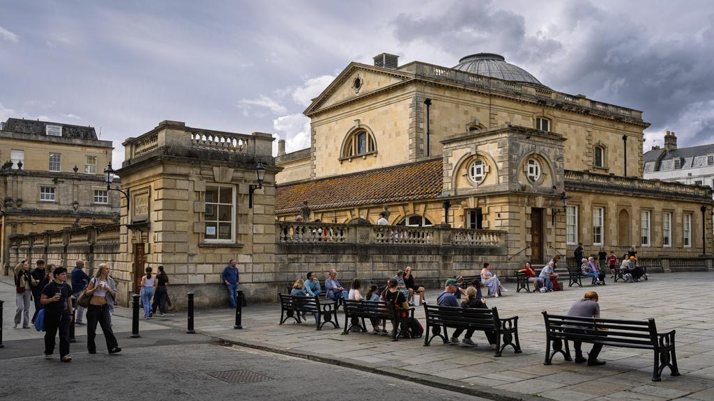

# Model Output Gallery

Generated on: 2026-09-06 00:37:14 BST

- *Evaluation lane:* assisted
- *Assessment:* General checks + metadata fields and duplicate keywords; length limits and factual accuracy not assessed
- *Input image:* JPEG, 9,984 x 5,616 pixels (56.1 MP), 39.4 MB

This run records model responses to one shared image and prompt (evaluation
lane: assisted). Mechanical checks are not factual-accuracy judgments; inspect
the image, prompt and final answers before choosing a model. Results do not
establish fitness for other tasks.

Complete per-model evidence artifact with image metadata, the source prompt, a
facts-only chooser, and full generated or crash output for every attempted
model.

## Reference Image



## Current-run Chooser

Mechanical observations and captured resource facts for this run only. No concerns detected does not mean the response fulfilled an arbitrary prompt or described the image accurately. Consult the assessment scope above. Total time is end-to-end; throughput covers generation only and requires at least 16 generated tokens. Prefill/first is first-token latency when captured; Prompt tok is the full rendered prompt including image tokens, which drives prefill cost. For cross-attention architectures the token count reflects the tokenised text burden only, not total vision prefill compute.

<!-- markdownlint-disable MD034 MD037 MD049 -->

| Model                                                                                                                   | Mechanical checks      | Total s | Gen TPS    | Prefill/first s | Peak GB | Prompt tok | Gen tok | Observations                                                         |
|-------------------------------------------------------------------------------------------------------------------------|------------------------|---------|------------|-----------------|---------|------------|---------|----------------------------------------------------------------------|
| [`LiquidAI/LFM2.5-VL-450M-MLX-bf16`](#model-liquidai-lfm25-vl-450m-mlx-bf16)                                            | `no concerns detected` | 1.79s   | 472 tok/s  | 0.14            | 1.7     | 2,648      | 110     | none                                                                 |
| [`mlx-community/Devstral-Small-2-24B-Instruct-2512-5bit`](#model-mlx-community-devstral-small-2-24b-instruct-2512-5bit) | `no concerns detected` | 10.86s  | 30.5 tok/s | 2.95            | 22      | 2,073      | 124     | none                                                                 |
| [`mlx-community/ERNIE-4.5-VL-28B-A3B-Thinking-4bit`](#model-mlx-community-ernie-45-vl-28b-a3b-thinking-4bit)            | `no concerns detected` | 13.54s  | 95.6 tok/s | 1.18            | 19      | 1,625      | 943     | none                                                                 |
| [`mlx-community/GLM-4.6V-Flash-4bit`](#model-mlx-community-glm-46v-flash-4bit)                                          | `no concerns detected` | 8.05s   | 77.9 tok/s | 5.08            | 8.7     | 6,354      | 71      | none                                                                 |
| [`mlx-community/Idefics3-8B-Llama3-bf16`](#model-mlx-community-idefics3-8b-llama3-bf16)                                 | `no concerns detected` | 9.49s   | 33.2 tok/s | 1.85            | 18      | 2,628      | 162     | none                                                                 |
| [`mlx-community/InternVL3-8B-bf16`](#model-mlx-community-internvl3-8b-bf16)                                             | `no concerns detected` | 6.36s   | 34.8 tok/s | 0.97            | 17      | 2,640      | 96      | none                                                                 |
| [`mlx-community/Kimi-VL-A3B-Thinking-2506-8bit`](#model-mlx-community-kimi-vl-a3b-thinking-2506-8bit)                   | `no concerns detected` | 11.64s  | 66.8 tok/s | 0.70            | 20      | 1,334      | 527     | none                                                                 |
| [`mlx-community/LFM2.5-VL-1.6B-bf16`](#model-mlx-community-lfm25-vl-16b-bf16)                                           | `no concerns detected` | 2.76s   | 189 tok/s  | 0.69            | 4.0     | 2,648      | 142     | none                                                                 |
| [`mlx-community/LFM2.5-VL-3B-OptiQ-4bit`](#model-mlx-community-lfm25-vl-3b-optiq-4bit)                                  | `no concerns detected` | 2.38s   | 207 tok/s  | 0.56            | 4.0     | 2,640      | 78      | none                                                                 |
| [`mlx-community/Ministral-3-14B-Instruct-2512-mxfp4`](#model-mlx-community-ministral-3-14b-instruct-2512-mxfp4)         | `no concerns detected` | 5.94s   | 66.9 tok/s | 1.78            | 12      | 2,606      | 142     | none                                                                 |
| [`mlx-community/Ministral-3-14B-Instruct-2512-nvfp4`](#model-mlx-community-ministral-3-14b-instruct-2512-nvfp4)         | `no concerns detected` | 6.59s   | 64.8 tok/s | 1.85            | 12      | 2,606      | 179     | none                                                                 |
| [`mlx-community/Ministral-3-3B-Instruct-2512-4bit`](#model-mlx-community-ministral-3-3b-instruct-2512-4bit)             | `no concerns detected` | 3.93s   | 192 tok/s  | 0.81            | 6.4     | 2,605      | 146     | none                                                                 |
| [`mlx-community/Molmo2-8B-4bit`](#model-mlx-community-molmo2-8b-4bit)                                                   | `no concerns detected` | 6.62s   | 72.5 tok/s | 2.53            | 8.1     | 1,539      | 155     | none                                                                 |
| [`mlx-community/North-Micro-Vision-Instruct-4bit`](#model-mlx-community-north-micro-vision-instruct-4bit)               | `no concerns detected` | 5.92s   | 217 tok/s  | 3.16            | 3.9     | 4,077      | 129     | none                                                                 |
| [`mlx-community/Ornith-1.5-35B-A3B-OptiQ-4bit`](#model-mlx-community-ornith-15-35b-a3b-optiq-4bit)                      | `no concerns detected` | 5.50s   | 104 tok/s  | 0.79            | 24      | 1,297      | 134     | none                                                                 |
| [`mlx-community/Phi-3.5-vision-instruct-bf16`](#model-mlx-community-phi-35-vision-instruct-bf16)                        | `no concerns detected` | 4.45s   | 56.0 tok/s | 0.30            | 9.3     | 1,146      | 137     | none                                                                 |
| [`mlx-community/Qwen3-VL-2B-Thinking-bf16`](#model-mlx-community-qwen3-vl-2b-thinking-bf16)                             | `no concerns detected` | 30.27s  | 89.5 tok/s | 18.46           | 8.4     | 16,660     | 909     | none                                                                 |
| [`mlx-community/Qwen3-VL-30B-A3B-Instruct-4bit`](#model-mlx-community-qwen3-vl-30b-a3b-instruct-4bit)                   | `no concerns detected` | 63.27s  | 87.1 tok/s | 58.86           | 23      | 16,658     | 136     | none                                                                 |
| [`mlx-community/Qwen3.5-35B-A3B-4bit`](#model-mlx-community-qwen35-35b-a3b-4bit)                                        | `no concerns detected` | 58.66s  | 109 tok/s  | 53.92           | 24      | 16,674     | 135     | none                                                                 |
| [`mlx-community/Qwen3.5-9B-MLX-4bit`](#model-mlx-community-qwen35-9b-mlx-4bit)                                          | `no concerns detected` | 60.12s  | 91.1 tok/s | 55.79           | 10      | 16,674     | 119     | none                                                                 |
| [`mlx-community/Qwen3.8-27B-4bit`](#model-mlx-community-qwen38-27b-4bit)                                                | `no concerns detected` | 80.22s  | 30.6 tok/s | 72.76           | 21      | 16,674     | 130     | none                                                                 |
| [`mlx-community/SmolVLM2-2.2B-Instruct-mlx`](#model-mlx-community-smolvlm2-22b-instruct-mlx)                            | `no concerns detected` | 9.40s   | 125 tok/s  | 0.61            | 5.4     | 1,442      | 101     | none                                                                 |
| [`mlx-community/Step-3.7-Flash-oQ3e`](#model-mlx-community-step-37-flash-oq3e)                                          | `no concerns detected` | 38.78s  | 52.0 tok/s | 19.02           | 92      | 3,505      | 118     | none                                                                 |
| [`mlx-community/diffusiongemma-26B-A4B-it-mxfp8`](#model-mlx-community-diffusiongemma-26b-a4b-it-mxfp8)                 | `no concerns detected` | 6.97s   | 53.2 tok/s | 1.00            | 28      | 615        | 87      | none                                                                 |
| [`mlx-community/gemma-3-27b-it-qat-4bit`](#model-mlx-community-gemma-3-27b-it-qat-4bit)                                 | `no concerns detected` | 8.98s   | 30.4 tok/s | 1.09            | 17      | 610        | 141     | none                                                                 |
| [`mlx-community/gemma-4-26b-a4b-it-4bit`](#model-mlx-community-gemma-4-26b-a4b-it-4bit)                                 | `no concerns detected` | 4.34s   | 129 tok/s  | 0.40            | 16      | 619        | 105     | none                                                                 |
| [`mlx-community/gemma-4-31b-it-4bit`](#model-mlx-community-gemma-4-31b-it-4bit)                                         | `no concerns detected` | 7.65s   | 26.8 tok/s | 1.08            | 20      | 619        | 90      | none                                                                 |
| [`mlx-community/granite-4.0-3b-vision-4bit`](#model-mlx-community-granite-40-3b-vision-4bit)                            | `no concerns detected` | 2.56s   | 175 tok/s  | 0.45            | 4.8     | 1,537      | 100     | none                                                                 |
| [`mlx-community/pixtral-12b-8bit`](#model-mlx-community-pixtral-12b-8bit)                                               | `no concerns detected` | 6.76s   | 39.6 tok/s | 1.59            | 15      | 2,677      | 117     | none                                                                 |
| [`mlx-community/GLM-4.6V-nvfp4`](#model-mlx-community-glm-46v-nvfp4)                                                    | `concerns detected`    | 30.56s  | 43.3 tok/s | 13.71           | 78      | 6,354      | 119     | control tokens visible                                               |
| [`mlx-community/Muse-Glimmer-30B-OptiQ-4bit`](#model-mlx-community-muse-glimmer-30b-optiq-4bit)                         | `major concerns`       | 53.05s  | 24.9 tok/s | 7.56            | 25      | 4,444      | 1,000   | missing required fields; cut off at token limit; role tokens visible |
| [`mlx-community/X-Reasoner-7B-8bit`](#model-mlx-community-x-reasoner-7b-8bit)                                           | `major concerns`       | 23.68s  | 58.2 tok/s | 16.68           | 14      | 16,669     | 275     | repeated text; stopped early: repeating; duplicate keywords          |
| [`mlx-community/nanoLLaVA-1.5-4bit`](#model-mlx-community-nanollava-15-4bit)                                            | `major concerns`       | 1.59s   | 360 tok/s  | 0.10            | 1.7     | 345        | 126     | missing required fields                                              |
<!-- markdownlint-enable MD034 MD037 MD049 -->

## Resource Highlights

Quickest completion without detected concerns (end-to-end, including model load): `LiquidAI/LFM2.5-VL-450M-MLX-bf16` at 1.79s

Lowest peak memory among completions without detected concerns: `LiquidAI/LFM2.5-VL-450M-MLX-bf16` at 1.7 GB

Decode tok/s stays per model in the chooser and is not averaged across models: tokenizers, image-token expansion and reasoning lengths differ too much for a cross-model mean to guide a choice.

## Avoid for This Run

<!-- markdownlint-disable MD034 MD037 MD049 -->

| Model                                                                                           | Mechanical checks | Observations                                                         |
|-------------------------------------------------------------------------------------------------|-------------------|----------------------------------------------------------------------|
| [`mlx-community/Muse-Glimmer-30B-OptiQ-4bit`](#model-mlx-community-muse-glimmer-30b-optiq-4bit) | `major concerns`  | missing required fields; cut off at token limit; role tokens visible |
| [`mlx-community/X-Reasoner-7B-8bit`](#model-mlx-community-x-reasoner-7b-8bit)                   | `major concerns`  | repeated text; stopped early: repeating; duplicate keywords          |
| [`mlx-community/nanoLLaVA-1.5-4bit`](#model-mlx-community-nanollava-15-4bit)                    | `major concerns`  | missing required fields                                              |
<!-- markdownlint-enable MD034 MD037 MD049 -->

## Output at a Glance

The first 280 characters of each model's final answer (or failure evidence for crashes), in chooser order. A closed reasoning trace is left out of the preview and reported as an omitted-character count; the complete output, trace included, is in the model's evidence block below.

<!-- markdownlint-disable MD034 MD037 MD049 -->

| Model                                                                                                                   | Mechanical checks      | Output preview                                                                                                                                                                                                                                                                                                                                                               |
|-------------------------------------------------------------------------------------------------------------------------|------------------------|------------------------------------------------------------------------------------------------------------------------------------------------------------------------------------------------------------------------------------------------------------------------------------------------------------------------------------------------------------------------------|
| [`LiquidAI/LFM2.5-VL-450M-MLX-bf16`](#model-liquidai-lfm25-vl-450m-mlx-bf16)                                            | `no concerns detected` | Title:<br>Bath Abbey Churchyard: A Historic Site in Bath, England<br><br>Description:<br>A bustling plaza in Bath, England, features a historic Roman Baths and Grand Pump Room complex, with visitors sitting on benches and strolling through the Abbey Churchyard. The scene is set under an o...                                                                         |
| [`mlx-community/Devstral-Small-2-24B-Instruct-2512-5bit`](#model-mlx-community-devstral-small-2-24b-instruct-2512-5bit) | `no concerns detected` | Title:<br>Visitors at the Roman Baths and Grand Pump Room<br><br>Description:<br>Tourists and visitors sit on benches and stroll through Abbey Churchyard outside the historic Roman Baths and Grand Pump Room complex in Bath, Somerset, England, on a cloudy day.<br><br>Keywords:<br>Abbey Church Yard,...                                                                |
| [`mlx-community/ERNIE-4.5-VL-28B-A3B-Thinking-4bit`](#model-mlx-community-ernie-45-vl-28b-a3b-thinking-4bit)            | `no concerns detected` | Title: Bath Abbey Churchyard with Roman Baths and Grand Pump Room<br>Description: On 2026-09-01 at 15:04 UTC+01:00, tourists and visitors stroll through Bath's Abbey Churchyard outside the historic Roman Baths and Grand Pump Room complex, with a cloudy sky over the Georgian-style...[2,849 characters of reasoning omitted; complete output in the evidence block]    |
| [`mlx-community/GLM-4.6V-Flash-4bit`](#model-mlx-community-glm-46v-flash-4bit)                                          | `no concerns detected` | Title: Bath's Roman Baths Plaza<br>Description: Tourists sit on benches and stroll near the historic Roman Baths building with a domed roof in Bath, England, under an overcast sky.<br>Keywords: Bath, Roman Baths, Plaza, Benches, Domed roof, Bath stone, Overcast sky, Pedestrians, His...                                                                               |
| [`mlx-community/Idefics3-8B-Llama3-bf16`](#model-mlx-community-idefics3-8b-llama3-bf16)                                 | `no concerns detected` | Title: Abbey Churchyard in Bath, England on a Cloudy Day<br><br>Description: The Abbey Churchyard outside the historic Roman Baths and Grand Pump Room complex in Bath, Somerset, England, is filled with tourists and visitors on a cloudy day. The neoclassical architecture of the build...                                                                               |
| [`mlx-community/InternVL3-8B-bf16`](#model-mlx-community-internvl3-8b-bf16)                                             | `no concerns detected` | Title: Bath Abbey Churchyard on a Cloudy Day<br><br>Description: Tourists and visitors enjoy the historic Roman Baths and Grand Pump Room complex on a cloudy day, with benches and neoclassical architecture.<br><br>Keywords: Abbey Churchyard, Bath, Bath Somerset, Bath stone buildings, Benc...                                                                         |
| [`mlx-community/Kimi-VL-A3B-Thinking-2506-8bit`](#model-mlx-community-kimi-vl-a3b-thinking-2506-8bit)                   | `no concerns detected` | Title: Tourists at Roman Baths and Grand Pump Room in Bath, Somerset, England<br><br>Description: Tourists and visitors sit on benches and stroll through the Abbey Churchyard outside the historic Roman Baths and Grand Pump Room complex in Bath, Somerset, England, on a cloudy day, wi...[1,822 characters of reasoning omitted; complete output in the evidence block] |
| [`mlx-community/LFM2.5-VL-1.6B-bf16`](#model-mlx-community-lfm25-vl-16b-bf16)                                           | `no concerns detected` | Title: Historic Bath Abbey Churchyard<br><br>Description: Tourists and visitors sit on benches and stroll through the Abbey Churchyard outside the historic Roman Baths and Grand Pump Room complex in Bath, Somerset, England, on a cloudy day. The scene captures the grandeur of neoclas...                                                                               |
| [`mlx-community/LFM2.5-VL-3B-OptiQ-4bit`](#model-mlx-community-lfm25-vl-3b-optiq-4bit)                                  | `no concerns detected` | Title: Tourists relax in Abbey Churchyard, Bath, England.<br>Description: People sit on benches and stroll near historic stone buildings with a dome under an overcast sky.<br>Keywords: Abbey Churchyard, Bath, England, Georgian architecture, Neoclassical architecture, Public Square,...                                                                                |
| [`mlx-community/Ministral-3-14B-Instruct-2512-mxfp4`](#model-mlx-community-ministral-3-14b-instruct-2512-mxfp4)         | `no concerns detected` | Title:<br>**Abbey Churchyard, Bath – Tourists and Georgian Architecture**<br><br>Description:<br>A lively public square in the Abbey Churchyard, Bath, England, shows tourists and visitors sitting on benches and strolling around the historic Grand Pump Room and its neoclassical dome on an...                                                                          |
| [`mlx-community/Ministral-3-14B-Instruct-2512-nvfp4`](#model-mlx-community-ministral-3-14b-instruct-2512-nvfp4)         | `no concerns detected` | **Title:**<br>*Bath Abbey Churchyard: Georgian Grandeur on a Cloudy Day*<br><br>**Description:**<br>On **1 September 2026** under an overcast sky, tourists and locals gather in **Bath Abbey Churchyard** outside the historic **Roman Baths and Grand Pump Room** complex, sitting on benches a...                                                                         |
| [`mlx-community/Ministral-3-3B-Instruct-2512-4bit`](#model-mlx-community-ministral-3-3b-instruct-2512-4bit)             | `no concerns detected` | Title:<br>**Grand Pump Room Plaza, Bath Abbey Churchyard – Tourist Square**<br><br>Description:<br>A public square in Bath, England, on a cloudy day, features historic Georgian architecture with stone balustrades and a prominent dome of the Grand Pump Room, surrounded by benches where vis...                                                                         |
| [`mlx-community/Molmo2-8B-4bit`](#model-mlx-community-molmo2-8b-4bit)                                                   | `no concerns detected` | Title: Abbey Churchyard Scene with Roman Baths and Pump Room<br><br>Description: On a cloudy day in Bath, Somerset, visitors sit on benches and stroll through the Abbey Churchyard, passing historic stone buildings including the Roman Baths and Grand Pump Room. The scene captures the...                                                                               |
| [`mlx-community/North-Micro-Vision-Instruct-4bit`](#model-mlx-community-north-micro-vision-instruct-4bit)               | `no concerns detected` | Title: Abbey Churchyard, Roman Baths, Grand Pump Room, Bath, Somerset, England<br><br>Description: Tourists and visitors sit on benches and stroll through the Abbey Churchyard outside the historic Roman Baths and Grand Pump Room complex in Bath, Somerset, England, on a cloudy day. T...                                                                               |
| [`mlx-community/Ornith-1.5-35B-A3B-OptiQ-4bit`](#model-mlx-community-ornith-15-35b-a3b-optiq-4bit)                      | `no concerns detected` | Title: Visitors Relax at Bath's Abbey Churchyard<br><br>Description: Tourists and visitors sit on black benches and stroll across the stone-paved Abbey Churchyard outside the historic Roman Baths and Grand Pump Room complex in Bath, Somerset. The grand neoclassical building with its...                                                                               |
| [`mlx-community/Phi-3.5-vision-instruct-bf16`](#model-mlx-community-phi-35-vision-instruct-bf16)                        | `no concerns detected` | Title: Tourists Enjoy a Cloudy Day at Bath's Historic Abbey Churchyard<br><br>Description: On a cloudy day in Bath, Somerset, England, tourists and locals gather in the Abbey Churchyard, sitting on benches and admiring the historic Roman Baths and Grand Pump Room complex.<br><br>Keywords:...                                                                         |
| [`mlx-community/Qwen3-VL-2B-Thinking-bf16`](#model-mlx-community-qwen3-vl-2b-thinking-bf16)                             | `no concerns detected` | Title: Bath Roman Baths Plaza with Visitors<br>Description: Overcast sky illuminates Bath Roman Baths plaza where visitors sit on stone benches, surrounded by historic stone buildings with a dome and balustrades.<br>Keywords: Abbey Churchyard, Balustrades, Bath, Bath England, Bath S...[3,582 characters of reasoning omitted; complete output in the evidence block] |
| [`mlx-community/Qwen3-VL-30B-A3B-Instruct-4bit`](#model-mlx-community-qwen3-vl-30b-a3b-instruct-4bit)                   | `no concerns detected` | Title: Roman Baths complex in Bath, England<br>Description: On a cloudy day in Bath, England, visitors relax on benches and walk through the stone-paved square in front of the historic Roman Baths and Grand Pump Room. The scene features classical architecture with a prominent dom...                                                                                  |
| [`mlx-community/Qwen3.5-35B-A3B-4bit`](#model-mlx-community-qwen35-35b-a3b-4bit)                                        | `no concerns detected` | Title: Visitors at Roman Baths and Grand Pump Room<br><br>Description: Tourists and visitors relax on black benches and stroll through the stone plaza outside the historic Roman Baths and Grand Pump Room complex in Bath, Somerset, under an overcast sky. The scene features distinctiv...                                                                               |
| [`mlx-community/Qwen3.5-9B-MLX-4bit`](#model-mlx-community-qwen35-9b-mlx-4bit)                                          | `no concerns detected` | Title:<br>Visitors relax on benches outside the Roman Baths in Bath, England.<br><br>Description:<br>Tourists and pedestrians stroll and sit on benches in the open plaza of the Roman Baths complex in Bath, Somerset, under an overcast sky, with Georgian-style stone buildings and balustrade...                                                                         |
| [`mlx-community/Qwen3.8-27B-4bit`](#model-mlx-community-qwen38-27b-4bit)                                                | `no concerns detected` | Title:<br>Visitors relaxing in the Abbey Churchyard, Bath<br>Description:<br>A wide view of the Abbey Churchyard in Bath, Somerset, showing visitors sitting on black benches and strolling on the paved square. The historic Bath stone buildings of the Roman Baths and Grand Pump Room comp...                                                                            |
| [`mlx-community/SmolVLM2-2.2B-Instruct-mlx`](#model-mlx-community-smolvlm2-22b-instruct-mlx)                            | `no concerns detected` | Title: Bath Abbey Churchyard<br>Description: Tourists and visitors sit on benches and stroll through the Abbey Churchyard outside the historic Roman Baths and Grand Pump Room complex in Bath, Somerset, England, on a cloudy day.<br>Keywords: Abbey Church Yard, Abbey Churchyard, Bath,...                                                                               |
| [`mlx-community/Step-3.7-Flash-oQ3e`](#model-mlx-community-step-37-flash-oq3e)                                          | `no concerns detected` | Title:<br>Roman Baths and Grand Pump Room, Bath, Somerset<br><br>Description:<br>Visitors sit on benches and stroll through the Abbey Churchyard outside the historic Roman Baths and Grand Pump Room complex in Bath, Somerset, England, on a cloudy day.<br><br>Keywords:<br>Abbey Church Yard, Abbey Ch...                                                                |
| [`mlx-community/diffusiongemma-26B-A4B-it-mxfp8`](#model-mlx-community-diffusiongemma-26b-a4b-it-mxfp8)                 | `no concerns detected` | Title: Visitors at the Grand Pump Room, Bath, England<br>Description: Tourists sit on benches and stroll through the Abbey Churchyard outside the historic Roman Baths and Grand Pump Room under an overcast sky.<br>Keywords: Bath, Somerset, England, Grand Pump Room, Georgian architect...                                                                               |
| [`mlx-community/gemma-3-27b-it-qat-4bit`](#model-mlx-community-gemma-3-27b-it-qat-4bit)                                 | `no concerns detected` | Title: Abbey Churchyard &amp; Grand Pump Room, Bath, September 2026<br><br>Description: Captured on 1st September 2026, pedestrians relax and stroll within Abbey Churchyard, adjacent to the Grand Pump Room complex in Bath, Somerset, under an overcast sky. The scene features Bath stone b...                                                                           |
| [`mlx-community/gemma-4-26b-a4b-it-4bit`](#model-mlx-community-gemma-4-26b-a4b-it-4bit)                                 | `no concerns detected` | Title: Visitors at the Grand Pump Room in Bath<br>Description: Tourists sit on benches and stroll through the historic Abbey Churchyard outside the Grand Pump Room in Bath, Somerset, on a cloudy day. The scene features neoclassical architecture built from golden Bath stone under...                                                                                   |
| [`mlx-community/gemma-4-31b-it-4bit`](#model-mlx-community-gemma-4-31b-it-4bit)                                         | `no concerns detected` | Title: Visitors at the Roman Baths and Grand Pump Room<br>Description: Tourists stroll and relax on benches in the Abbey Churchyard outside the historic Roman Baths and Grand Pump Room in Bath, Somerset, under an overcast sky.<br>Keywords: Abbey Churchyard, Bath, Somerset, England,...                                                                                |
| [`mlx-community/granite-4.0-3b-vision-4bit`](#model-mlx-community-granite-40-3b-vision-4bit)                            | `no concerns detected` | Title: "Bath's Historic Abbey Churchyard: A Gathering of Tourists"<br>Description: "A cloudy day in Bath's Abbey Churchyard, where tourists and visitors sit on benches and stroll through the historic Roman Baths and Grand Pump Room complex."<br>Keywords: Abbey Churchyard, Bath, Roma...                                                                               |
| [`mlx-community/pixtral-12b-8bit`](#model-mlx-community-pixtral-12b-8bit)                                               | `no concerns detected` | Title:<br>Visitors in Abbey Churchyard near Roman Baths<br><br>Description:<br>People sit on benches and walk through the Abbey Churchyard near the historic Roman Baths and Grand Pump Room in Bath, England, under an overcast sky.<br><br>Keywords:<br>Abbey Church Yard, Abbey Churchyard, Balustrades...                                                                |
| [`mlx-community/GLM-4.6V-nvfp4`](#model-mlx-community-glm-46v-nvfp4)                                                    | `concerns detected`    | <\|begin_of_box\|>Title: Visitors at Bath's Roman Baths Plaza<br>Description: Tourists and visitors sit on benches and stroll through the plaza outside the historic Roman Baths and Grand Pump Room complex in Bath, Somerset, England, on a cloudy day with Georgian architecture and Ba...                                                                                |
| [`mlx-community/Muse-Glimmer-30B-OptiQ-4bit`](#model-mlx-community-muse-glimmer-30b-optiq-4bit)                         | `major concerns`       | to=self<\|message\|>Create British-English catalogue metadata from the image and supplied context.<br><br>Treat any capture date/time and GPS as authoritative facts, but do not claim they are visible. Descriptive hints may be incomplete or wrong: retain details supported by the image,...                                                                             |
| [`mlx-community/X-Reasoner-7B-8bit`](#model-mlx-community-x-reasoner-7b-8bit)                                           | `major concerns`       | Title:<br>Bath Roman Baths and Grand Pump Room<br><br>Description:<br>Tourists and visitors gather outside the historic Roman Baths and Grand Pump Room complex in Bath, Somerset, under an overcast sky, with people strolling, sitting on benches, and enjoying the public square's Georgian ar...                                                                         |
| [`mlx-community/nanoLLaVA-1.5-4bit`](#model-mlx-community-nanollava-15-4bit)                                            | `major concerns`       | Title: "Tourists and Visitors at Abbey Churchyard Outside Historic Roman Baths and Grand Pump Room Complex in Bath, Somerset, England, on a Cloudy Day"<br>Description: A photograph of tourists sitting on benches and walking through the Abbey Churchyard outside the historic Roman...                                                                                   |
<!-- markdownlint-enable MD034 MD037 MD049 -->

## Run Stamps

- `mlx-vlm`: `0.7.0rc0`
- `mlx`: `0.32.3.dev20260905+2d27ab05f`
- `transformers`: `5.16.1`
- `tokenizers`: `0.23.2`
- `huggingface-hub`: `1.30.0`
- *Python Version:* 3.14.7
- *OS:* Darwin 25.6.0
- *macOS Version:* 26.6.2
- *GPU/Chip:* Apple M5 Max
- *MLX Device:* Apple M5 Max
- *GPU Architecture:* applegpu_g17s
- *RAM:* 128.0 GB
- *Recommended Working Set:* 108 GB
- *Fused Attention:* Available

## Image Metadata

- *Description:* Tourists and visitors sit on benches and stroll through the
  Abbey Churchyard outside the historic Roman Baths and Grand Pump Room
  complex in Bath, Somerset, England, on a cloudy day.
- *Keywords:* Abbey Church Yard, Abbey Churchyard, Balustrades, Bath, Bath
  England, Bath Somerset, Bath stone, Bath stone buildings, Benches, Dome,
  England, Georgian architecture, Grand Pump Room, Heritage site, Historic
  architecture, Neoclassical Architecture, Overcast Sky, Pedestrians, Plaza,
  Public Square, Public plaza, Roman Baths, Sightseeing, Sitting, Somerset,
  Street lamps, Tourism, Tourists, United Kingdom, Walking, ancient history,
  architecture, british culture, building exterior, city, classical
  architecture, cloudy sky, culture, day, europe, famous place, great britain,
  heritage, historic, historic landmark, history, holiday, landmark, museum,
  neoclassical, outdoor, pedestrian area, people, signboard, square, stone
  building, tourist attraction, travel, travel destination, unesco world
  heritage, urban scene, vacation, visitors, walking tour
- *Date:* 2026-09-01 15:04:11 UTC+01:00
- *Time:* 15:04:11
- *GPS:* 51.380931°N, 2.359317°W

## Prompt

<!-- markdownlint-disable MD011 MD028 MD037 MD045 -->
>
> Create British-English catalogue metadata from the image and supplied
> context.
>
> Treat any capture date/time and GPS as authoritative facts, but do not claim
> they are visible. Descriptive hints may be incomplete or wrong: retain
> details supported by the image, correct conflicts, and add important visible
> details. Prefer image evidence when a hint conflicts, and omit uncertain
> details.
>
> Context: Authoritative context:
> &#45; Capture date/time: 2026-09-01 15:04:11 UTC+01:00
> &#45; GPS: 51.380931°N, 2.359317°W
>
> &#8203;Descriptive hints:
> &#45; Description hint: Tourists and visitors sit on benches and stroll through
> the Abbey Churchyard outside the historic Roman Baths and Grand Pump Room
> complex in Bath, Somerset, England, on a cloudy day.
> &#45; Keyword hints: Abbey Church Yard, Abbey Churchyard, Balustrades, Bath,
> Bath England, Bath Somerset, Bath stone, Bath stone buildings, Benches,
> Dome, England, Georgian architecture, Grand Pump Room, Heritage site,
> Historic architecture, Neoclassical Architecture, Overcast Sky, Pedestrians,
> Plaza, Public Square
>
> &#8203;Write:
> &#45; a concrete 5-10-word title;
> &#45; a 1-2-sentence factual description combining relevant context with the
> main visible subject, setting, action, lighting, and distinctive details;
> &#45; 10-18 unique, comma-separated keywords covering relevant context and
> visible details.
>
> &#8203;Return exactly these three sections and nothing else:
> &#8203;Title:
> &#8203;Description:
> &#8203;Keywords:
<!-- markdownlint-enable MD011 MD028 MD037 MD045 -->

## Complete Per-model Evidence

Complete generated or crash evidence for every attempted model.

<a id="model-liquidai-lfm25-vl-450m-mlx-bf16"></a>

### LiquidAI/LFM2.5-VL-450M-MLX-bf16

<details>
<summary>Complete evidence: LiquidAI/LFM2.5-VL-450M-MLX-bf16</summary>

- *Execution:* completed
- *Mechanical checks:* no concerns detected
- *Assessment:* General checks + metadata fields and duplicate keywords;
  length limits and factual accuracy not assessed
- *Maintainer status:* none
- *Observations:* none
- *Arch supported by installed mlx-vlm:* yes (model_type lfm2-vl via lfm2_vl)
- *Model load time:* 0.68s
- *Generation time:* 0.81s
- *Total time:* 1.79s
- *Input validation time:* 0.294
- *Prompt preparation time:* 0.00708
- *First-token latency:* 0.138
- *Cleanup time:* 0.0629
- *Prompt tokens:* 2,648
- *Generation tokens:* 110
- *Total tokens:* 2,758
- *Prompt throughput (raw):* 19,122 tok/s
- *Generation throughput (raw):* 472 tok/s
- *Peak memory:* 1.7
- *Active memory:* 0.90
- *Cache memory:* 0.10
- *Model-load active memory:* 0.897
- *Post-cleanup active memory:* 0.000132
- *Post-cleanup cache memory:* 0.0
- *Stop reason:* completed
- *Requested maximum tokens:* 1000
- *Rendered prompt characters:* 1467
- *Image placeholders:* 1
- *Processed image:* not captured
- *Image patch count:* not captured
- *Processor:* transformers.models.lfm2_vl.processing_lfm2_vl.Lfm2VlProcessor
- *Tokenizer:* transformers.tokenization_utils_tokenizers.TokenizersBackend
- *Requested model revision:* not requested
- *Resolved model revision:* ed71acdae0799c98cb450787d049d1343b65cd52
- *Resolved snapshot path:* ~/.cache/huggingface/hub/models--LiquidAI--LFM2.5-VL-450M-MLX-bf16/snapshots/ed71acdae0799c98cb450787d049d1343b65cd52
- *Generation settings:* {"max_tokens": 1000, "prefill_step_size": 2048,
  "temperature": 0.0, "top_p": 1.0}
- *EOS token:* <\|im_end\|>

*Readable output:*

<pre class="model-output-readable">
Title:
Bath Abbey Churchyard: A Historic Site in Bath, England

Description:
A bustling plaza in Bath, England, features a historic Roman Baths and Grand Pump Room complex, with visitors sitting on benches and strolling through the Abbey Churchyard. The scene is set under an overcast sky, with a prominent dome and classical architecture visible in the background.

Keywords:
Bath Abbey Churchyard, Roman Baths, Grand Pump Room, Bath, England, historic architecture, pedestrian traffic, public square, overcast sky
</pre>

</details>

---

<a id="model-mlx-community-devstral-small-2-24b-instruct-2512-5bit"></a>

### mlx-community/Devstral-Small-2-24B-Instruct-2512-5bit

<details>
<summary>Complete evidence: mlx-community/Devstral-Small-2-24B-Instruct-2512-5bit</summary>

- *Execution:* completed
- *Mechanical checks:* no concerns detected
- *Assessment:* General checks + metadata fields and duplicate keywords;
  length limits and factual accuracy not assessed
- *Maintainer status:* none
- *Observations:* none
- *Arch supported by installed mlx-vlm:* yes (model_type mistral3)
- *Model load time:* 3.26s
- *Generation time:* 7.59s
- *Total time:* 10.86s
- *Input validation time:* 4.49e-05
- *Prompt preparation time:* 0.00782
- *First-token latency:* 2.95
- *Cleanup time:* 0.115
- *Prompt tokens:* 2,073
- *Generation tokens:* 124
- *Total tokens:* 2,197
- *Prompt throughput (raw):* 704 tok/s
- *Generation throughput (raw):* 30.5 tok/s
- *Peak memory:* 22
- *Active memory:* 18
- *Cache memory:* 0.42
- *Model-load active memory:* 18
- *Post-cleanup active memory:* 0.000394
- *Post-cleanup cache memory:* 0.0
- *Stop reason:* completed
- *Requested maximum tokens:* 1000
- *Rendered prompt characters:* 1416
- *Image placeholders:* 0
- *Processed image:* not captured
- *Image patch count:* not captured
- *Processor:* mlx_vlm.models.mistral3.processing_mistral3.Mistral3Processor
- *Tokenizer:* transformers.tokenization_utils_tokenizers.TokenizersBackend
- *Requested model revision:* not requested
- *Resolved model revision:* 0a970d20ad7da57b0e2accc35c5b8628f5d02063
- *Resolved snapshot path:* ~/.cache/huggingface/hub/models--mlx-community--Devstral-Small-2-24B-Instruct-2512-5bit/snapshots/0a970d20ad7da57b0e2accc35c5b8628f5d02063
- *Generation settings:* {"max_tokens": 1000, "prefill_step_size": 2048,
  "temperature": 0.0, "top_p": 1.0}
- *EOS token:* &lt;/s&gt;

*Readable output:*

<pre class="model-output-readable">
Title:
Visitors at the Roman Baths and Grand Pump Room

Description:
Tourists and visitors sit on benches and stroll through Abbey Churchyard outside the historic Roman Baths and Grand Pump Room complex in Bath, Somerset, England, on a cloudy day.

Keywords:
Abbey Church Yard, Abbey Churchyard, Balustrades, Bath, Bath England, Bath Somerset, Bath stone, Bath stone buildings, Benches, Dome, England, Georgian architecture, Grand Pump Room, Heritage site, Historic architecture, Neoclassical Architecture, Overcast Sky, Pedestrians, Plaza, Public Square
</pre>

</details>

---

<a id="model-mlx-community-ernie-45-vl-28b-a3b-thinking-4bit"></a>

### mlx-community/ERNIE-4.5-VL-28B-A3B-Thinking-4bit

<details>
<summary>Complete evidence: mlx-community/ERNIE-4.5-VL-28B-A3B-Thinking-4bit</summary>

- *Execution:* completed
- *Mechanical checks:* no concerns detected
- *Assessment:* General checks + metadata fields and duplicate keywords;
  length limits and factual accuracy not assessed
- *Maintainer status:* none
- *Observations:* none
- *Arch supported by installed mlx-vlm:* yes (model_type ernie4_5_moe_vl)
- *Model load time:* 1.94s
- *Generation time:* 11.59s
- *Total time:* 13.54s
- *Input validation time:* 5.44e-05
- *Prompt preparation time:* 0.00849
- *First-token latency:* 1.18
- *Cleanup time:* 0.107
- *Prompt tokens:* 1,625
- *Generation tokens:* 943
- *Total tokens:* 2,568
- *Prompt throughput (raw):* 1,377 tok/s
- *Generation throughput (raw):* 95.6 tok/s
- *Peak memory:* 19
- *Active memory:* 17
- *Cache memory:* 0.18
- *Model-load active memory:* 17.4
- *Post-cleanup active memory:* 0.000607
- *Post-cleanup cache memory:* 0.0
- *Stop reason:* completed
- *Requested maximum tokens:* 1000
- *Rendered prompt characters:* 1606
- *Image placeholders:* 0
- *Processed image:* not captured
- *Image patch count:* not captured
- *Processor:* mlx_vlm.models.ernie4_5_moe_vl.processing_ernie4_5_moe_vl.Ernie4_5_VLProcessor
- *Tokenizer:* mlx_vlm.models.ernie4_5_moe_vl.processing_ernie4_5_moe_vl.Ernie4_5_VLTokenizer
- *Requested model revision:* not requested
- *Resolved model revision:* 846ea5576854468f25af3767d769b0805b1b08b6
- *Resolved snapshot path:* ~/.cache/huggingface/hub/models--mlx-community--ERNIE-4.5-VL-28B-A3B-Thinking-4bit/snapshots/846ea5576854468f25af3767d769b0805b1b08b6
- *Generation settings:* {"enable_thinking": true, "max_tokens": 1000,
  "prefill_step_size": 2048, "temperature": 0.0, "thinking_budget": 800,
  "thinking_end_token": "&lt;/think&gt;", "thinking_start_token":
  "&lt;think&gt;", "top_p": 1.0}
- *EOS token:* &lt;/s&gt;

*Readable output:*

<pre class="model-output-readable">
Let's tackle this step by step. First, the title needs to be concrete, 5-10 words. The image is of Bath, specifically the Abbey Churchyard with the Roman Baths and Grand Pump Room. So maybe "Bath Abbey Churchyard with Roman Baths and Grand Pump Room" but wait, need to be more concise. Wait, the context mentions tourists in the churchyard outside the historic Roman Baths and Grand Pump Room. So maybe "Bath Abbey Churchyard with Roman Baths and Grand Pump Room" but let's check length. Wait, 5-10 words. Let's see: "Bath Abbey Churchyard with Roman Baths and Grand Pump Room" is 10 words. That's good.

Next, the description. Need to combine context: capture date is 2026-09-01 15:04:11 UTC+01:00, GPS 51.380931°N, 2.359317°W. The hint says tourists and visitors sit on benches and stroll through the Abbey Churchyard outside the historic Roman Baths and Grand Pump Room complex in Bath, Somerset, England, on a cloudy day. So the description should include the location (Bath, Somerset, England), the setting (Abbey Churchyard), the main elements (Roman Baths, Grand Pump Room, tourists, cloudy day), and maybe the time or weather. Wait, the hint says "on a cloudy day" so that's a key detail. Let's put it together: "On 2026-09-01 at 15:04 UTC+01:00, tourists and visitors stroll through Bath's Abbey Churchyard outside the historic Roman Baths and Grand Pump Room complex, with a cloudy sky over the Georgian-style buildings." Wait, but need to make sure it's 1-2 sentences. Let's check: "On 2026-09-01 at 15:04 UTC+01:00, tourists and visitors stroll through Bath's Abbey Churchyard outside the historic Roman Baths and Grand Pump Room complex, with a cloudy sky over the Georgian-style buildings." That's one sentence. Does it include all relevant context? Location (Bath), setting (Abbey Churchyard), main elements (Roman Baths, Grand Pump Room, tourists), lighting (cloudy day). Yes.

Keywords: Need 10-18 unique, comma-separated keywords. From the context: Abbey Church Yard, Abbey Churchyard, Balustrades, Bath, Bath England, Bath Somerset, Bath stone, Bath stone buildings, Benches, Dome, England, Georgian architecture, Grand Pump Room, Heritage site, Historic architecture, Neoclassical Architecture, Overcast Sky, Pedestrians, Plaza, Public Square. Let's pick the most relevant ones. Let's see: Abbey Churchyard, Bath, Somerset, England, Roman Baths, Grand Pump Room, Georgian architecture, Historic architecture, Neoclassical Architecture, Overcast Sky, Pedestrians, Plaza, Public Square, Bath stone, Heritage site, Benches. Wait, need to make sure they are unique. Let's list them:

1. Abbey Churchyard
2. Bath
3. Somerset
4. England
5. Roman Baths
6. Grand Pump Room
7. Georgian architecture
8. Historic architecture
9. Neoclassical Architecture
10. Overcast Sky
11. Pedestrians
12. Plaza
13. Public Square
14. Bath stone

&lt;/think&gt;

Title: Bath Abbey Churchyard with Roman Baths and Grand Pump Room
Description: On 2026-09-01 at 15:04 UTC+01:00, tourists and visitors stroll through Bath's Abbey Churchyard outside the historic Roman Baths and Grand Pump Room complex, with a cloudy sky over the Georgian-style buildings.
Keywords: Abbey Churchyard, Bath, Somerset, England, Roman Baths, Grand Pump Room, Georgian architecture, Historic architecture, Neoclassical Architecture, Overcast Sky, Pedestrians, Plaza, Public Square, Bath stone, Heritage site, Benches
</pre>

<details>
<summary>Exact raw output</summary>

```text
Let's tackle this step by step. First, the title needs to be concrete, 5-10 words. The image is of Bath, specifically the Abbey Churchyard with the Roman Baths and Grand Pump Room. So maybe "Bath Abbey Churchyard with Roman Baths and Grand Pump Room" but wait, need to be more concise. Wait, the context mentions tourists in the churchyard outside the historic Roman Baths and Grand Pump Room. So maybe "Bath Abbey Churchyard with Roman Baths and Grand Pump Room" but let's check length. Wait, 5-10 words. Let's see: "Bath Abbey Churchyard with Roman Baths and Grand Pump Room" is 10 words. That's good.

Next, the description. Need to combine context: capture date is 2026-09-01 15:04:11 UTC+01:00, GPS 51.380931°N, 2.359317°W. The hint says tourists and visitors sit on benches and stroll through the Abbey Churchyard outside the historic Roman Baths and Grand Pump Room complex in Bath, Somerset, England, on a cloudy day. So the description should include the location (Bath, Somerset, England), the setting (Abbey Churchyard), the main elements (Roman Baths, Grand Pump Room, tourists, cloudy day), and maybe the time or weather. Wait, the hint says "on a cloudy day" so that's a key detail. Let's put it together: "On 2026-09-01 at 15:04 UTC+01:00, tourists and visitors stroll through Bath's Abbey Churchyard outside the historic Roman Baths and Grand Pump Room complex, with a cloudy sky over the Georgian-style buildings." Wait, but need to make sure it's 1-2 sentences. Let's check: "On 2026-09-01 at 15:04 UTC+01:00, tourists and visitors stroll through Bath's Abbey Churchyard outside the historic Roman Baths and Grand Pump Room complex, with a cloudy sky over the Georgian-style buildings." That's one sentence. Does it include all relevant context? Location (Bath), setting (Abbey Churchyard), main elements (Roman Baths, Grand Pump Room, tourists), lighting (cloudy day). Yes.

Keywords: Need 10-18 unique, comma-separated keywords. From the context: Abbey Church Yard, Abbey Churchyard, Balustrades, Bath, Bath England, Bath Somerset, Bath stone, Bath stone buildings, Benches, Dome, England, Georgian architecture, Grand Pump Room, Heritage site, Historic architecture, Neoclassical Architecture, Overcast Sky, Pedestrians, Plaza, Public Square. Let's pick the most relevant ones. Let's see: Abbey Churchyard, Bath, Somerset, England, Roman Baths, Grand Pump Room, Georgian architecture, Historic architecture, Neoclassical Architecture, Overcast Sky, Pedestrians, Plaza, Public Square, Bath stone, Heritage site, Benches. Wait, need to make sure they are unique. Let's list them:

1. Abbey Churchyard
2. Bath
3. Somerset
4. England
5. Roman Baths
6. Grand Pump Room
7. Georgian architecture
8. Historic architecture
9. Neoclassical Architecture
10. Overcast Sky
11. Pedestrians
12. Plaza
13. Public Square
14. Bath stone

</think>

Title: Bath Abbey Churchyard with Roman Baths and Grand Pump Room
Description: On 2026-09-01 at 15:04 UTC+01:00, tourists and visitors stroll through Bath's Abbey Churchyard outside the historic Roman Baths and Grand Pump Room complex, with a cloudy sky over the Georgian-style buildings.
Keywords: Abbey Churchyard, Bath, Somerset, England, Roman Baths, Grand Pump Room, Georgian architecture, Historic architecture, Neoclassical Architecture, Overcast Sky, Pedestrians, Plaza, Public Square, Bath stone, Heritage site, Benches
```

</details>

</details>

---

<a id="model-mlx-community-glm-46v-flash-4bit"></a>

### mlx-community/GLM-4.6V-Flash-4bit

<details>
<summary>Complete evidence: mlx-community/GLM-4.6V-Flash-4bit</summary>

- *Execution:* completed
- *Mechanical checks:* no concerns detected
- *Assessment:* General checks + metadata fields and duplicate keywords;
  length limits and factual accuracy not assessed
- *Maintainer status:* none
- *Observations:* none
- *Arch supported by installed mlx-vlm:* yes (model_type glm4v)
- *Model load time:* 1.57s
- *Generation time:* 6.46s
- *Total time:* 8.05s
- *Input validation time:* 6.32e-05
- *Prompt preparation time:* 0.00817
- *First-token latency:* 5.08
- *Cleanup time:* 0.0956
- *Prompt tokens:* 6,354
- *Generation tokens:* 71
- *Total tokens:* 6,425
- *Prompt throughput (raw):* 1,251 tok/s
- *Generation throughput (raw):* 77.9 tok/s
- *Peak memory:* 8.7
- *Active memory:* 7.1
- *Cache memory:* 0.46
- *Model-load active memory:* 7.07
- *Post-cleanup active memory:* 0.000919
- *Post-cleanup cache memory:* 0.0
- *Stop reason:* completed
- *Requested maximum tokens:* 1000
- *Rendered prompt characters:* 1497
- *Image placeholders:* 1
- *Processed image:* not captured
- *Image patch count:* not captured
- *Processor:* mlx_vlm.models.glm4v.processing.Glm46VProcessor
- *Tokenizer:* transformers.tokenization_utils_tokenizers.TokenizersBackend
- *Requested model revision:* not requested
- *Resolved model revision:* bd7b20686e8cbf22ad221a3de8399cdc5a2a7e0e
- *Resolved snapshot path:* ~/.cache/huggingface/hub/models--mlx-community--GLM-4.6V-Flash-4bit/snapshots/bd7b20686e8cbf22ad221a3de8399cdc5a2a7e0e
- *Generation settings:* {"max_tokens": 1000, "prefill_step_size": 2048,
  "temperature": 0.0, "top_p": 1.0}
- *EOS token:* <\|endoftext\|>

*Readable output:*

<pre class="model-output-readable">
Title: Bath's Roman Baths Plaza
Description: Tourists sit on benches and stroll near the historic Roman Baths building with a domed roof in Bath, England, under an overcast sky.
Keywords: Bath, Roman Baths, Plaza, Benches, Domed roof, Bath stone, Overcast sky, Pedestrians, Historic architecture
</pre>

</details>

---

<a id="model-mlx-community-idefics3-8b-llama3-bf16"></a>

### mlx-community/Idefics3-8B-Llama3-bf16

<details>
<summary>Complete evidence: mlx-community/Idefics3-8B-Llama3-bf16</summary>

- *Execution:* completed
- *Mechanical checks:* no concerns detected
- *Assessment:* General checks + metadata fields and duplicate keywords;
  length limits and factual accuracy not assessed
- *Maintainer status:* none
- *Observations:* none
- *Arch supported by installed mlx-vlm:* yes (model_type idefics3)
- *Model load time:* 2.10s
- *Generation time:* 7.38s
- *Total time:* 9.49s
- *Input validation time:* 6.29e-05
- *Prompt preparation time:* 0.00256
- *First-token latency:* 1.85
- *Cleanup time:* 0.0983
- *Prompt tokens:* 2,628
- *Generation tokens:* 162
- *Total tokens:* 2,790
- *Prompt throughput (raw):* 1,417 tok/s
- *Generation throughput (raw):* 33.2 tok/s
- *Peak memory:* 18
- *Active memory:* 17
- *Cache memory:* 0.43
- *Model-load active memory:* 16.9
- *Post-cleanup active memory:* 0.00149
- *Post-cleanup cache memory:* 0.0
- *Stop reason:* completed
- *Requested maximum tokens:* 1000
- *Rendered prompt characters:* 1453
- *Image placeholders:* 1
- *Processed image:* not captured
- *Image patch count:* not captured
- *Processor:* mlx_vlm.models.idefics3.processing_idefics3.Idefics3Processor
- *Tokenizer:* transformers.tokenization_utils_tokenizers.TokenizersBackend
- *Requested model revision:* not requested
- *Resolved model revision:* 8c2a30c48864f3251701b7bde40f601d25535098
- *Resolved snapshot path:* ~/.cache/huggingface/hub/models--mlx-community--Idefics3-8B-Llama3-bf16/snapshots/8c2a30c48864f3251701b7bde40f601d25535098
- *Generation settings:* {"max_tokens": 1000, "prefill_step_size": 2048,
  "temperature": 0.0, "top_p": 1.0}
- *EOS token:* <\|end_of_text\|>

*Readable output:*

<pre class="model-output-readable">
 Title: Abbey Churchyard in Bath, England on a Cloudy Day

Description: The Abbey Churchyard outside the historic Roman Baths and Grand Pump Room complex in Bath, Somerset, England, is filled with tourists and visitors on a cloudy day. The neoclassical architecture of the buildings is made of Bath stone, and the plaza features benches and balustrades.

Keywords: abbey churchyard, abbey churchyard bath, abbey churchyard bath england, abbey churchyard bath somerset, bath, bath england, bath somerset, bath stone, bath stone buildings, bath stone neoclassical architecture, benches, dome, england, grand pump room, heritage site, historic architecture, neoclassical architecture, overcast sky, pedestrians, plaza, public square
</pre>

</details>

---

<a id="model-mlx-community-internvl3-8b-bf16"></a>

### mlx-community/InternVL3-8B-bf16

<details>
<summary>Complete evidence: mlx-community/InternVL3-8B-bf16</summary>

- *Execution:* completed
- *Mechanical checks:* no concerns detected
- *Assessment:* General checks + metadata fields and duplicate keywords;
  length limits and factual accuracy not assessed
- *Maintainer status:* none
- *Observations:* none
- *Arch supported by installed mlx-vlm:* yes (model_type internvl_chat)
- *Model load time:* 2.03s
- *Generation time:* 4.32s
- *Total time:* 6.36s
- *Input validation time:* 5.45e-05
- *Prompt preparation time:* 0.00313
- *First-token latency:* 0.973
- *Cleanup time:* 0.107
- *Prompt tokens:* 2,640
- *Generation tokens:* 96
- *Total tokens:* 2,736
- *Prompt throughput (raw):* 2,712 tok/s
- *Generation throughput (raw):* 34.8 tok/s
- *Peak memory:* 17
- *Active memory:* 16
- *Cache memory:* 0.21
- *Model-load active memory:* 15.9
- *Post-cleanup active memory:* 0.0018
- *Post-cleanup cache memory:* 0.0
- *Stop reason:* completed
- *Requested maximum tokens:* 1000
- *Rendered prompt characters:* 1421
- *Image placeholders:* 1
- *Processed image:* not captured
- *Image patch count:* not captured
- *Processor:* mlx_vlm.models.internvl_chat.processor.InternVLChatProcessor
- *Tokenizer:* transformers.models.qwen2.tokenization_qwen2.Qwen2Tokenizer
- *Requested model revision:* not requested
- *Resolved model revision:* e0df3dd79263467173214b67ef6d6a0cc5a475fd
- *Resolved snapshot path:* ~/.cache/huggingface/hub/models--mlx-community--InternVL3-8B-bf16/snapshots/e0df3dd79263467173214b67ef6d6a0cc5a475fd
- *Generation settings:* {"max_tokens": 1000, "prefill_step_size": 2048,
  "temperature": 0.0, "top_p": 1.0}
- *EOS token:* <\|im_end\|>

*Readable output:*

<pre class="model-output-readable">
Title: Bath Abbey Churchyard on a Cloudy Day

Description: Tourists and visitors enjoy the historic Roman Baths and Grand Pump Room complex on a cloudy day, with benches and neoclassical architecture.

Keywords: Abbey Churchyard, Bath, Bath Somerset, Bath stone buildings, Benches, Dome, England, Georgian architecture, Grand Pump Room, Heritage site, Historic architecture, Neoclassical Architecture, Overcast Sky, Pedestrians, Plaza, Public Square
</pre>

</details>

---

<a id="model-mlx-community-kimi-vl-a3b-thinking-2506-8bit"></a>

### mlx-community/Kimi-VL-A3B-Thinking-2506-8bit

<details>
<summary>Complete evidence: mlx-community/Kimi-VL-A3B-Thinking-2506-8bit</summary>

- *Execution:* completed
- *Mechanical checks:* no concerns detected
- *Assessment:* General checks + metadata fields and duplicate keywords;
  length limits and factual accuracy not assessed
- *Maintainer status:* none
- *Observations:* none
- *Arch supported by installed mlx-vlm:* yes (model_type kimi_vl)
- *Model load time:* 2.44s
- *Generation time:* 9.18s
- *Total time:* 11.64s
- *Input validation time:* 5.1e-05
- *Prompt preparation time:* 0.00383
- *First-token latency:* 0.696
- *Cleanup time:* 0.101
- *Prompt tokens:* 1,334
- *Generation tokens:* 527
- *Total tokens:* 1,861
- *Prompt throughput (raw):* 1,917 tok/s
- *Generation throughput (raw):* 66.8 tok/s
- *Peak memory:* 20
- *Active memory:* 18
- *Cache memory:* 1.3
- *Model-load active memory:* 17.8
- *Post-cleanup active memory:* 0.00246
- *Post-cleanup cache memory:* 0.0
- *Stop reason:* completed
- *Requested maximum tokens:* 1000
- *Rendered prompt characters:* 1603
- *Image placeholders:* 0
- *Processed image:* not captured
- *Image patch count:* not captured
- *Processor:* mlx_vlm.models.kimi_vl.processing_kimi_vl.KimiVLProcessor
- *Tokenizer:* transformers.tokenization_utils_tokenizers.TokenizersBackend
- *Requested model revision:* not requested
- *Resolved model revision:* e5abbe34cbfabd829fafd0362856e5b468d19f85
- *Resolved snapshot path:* ~/.cache/huggingface/hub/models--mlx-community--Kimi-VL-A3B-Thinking-2506-8bit/snapshots/e5abbe34cbfabd829fafd0362856e5b468d19f85
- *Generation settings:* {"max_tokens": 1000, "prefill_step_size": 2048,
  "temperature": 0.0, "top_p": 1.0}
- *EOS token:* [EOS]

*Readable output:*

<pre class="model-output-readable">
◁think▷Okay, let's tackle this. First, I need to create a British-English catalogue metadata based on the image and the provided context. The user wants a title, a descriptive paragraph, and 10-18 keywords.

Starting with the title: The image shows the Roman Baths and Grand Pump Room in Bath, Somerset, England. The main elements are the historic buildings, people on benches, the cloudy sky. So a concise title could be "Tourists at Roman Baths and Grand Pump Room in Bath, Somerset, England."

For the description: Need to mention the setting, people, buildings, and the cloudy day. The context says it's a cloudy day, so include that. The buildings are historic, Georgian architecture, Bath stone. The scene is a public square with benches, tourists, pedestrians. So something like "Tourists and visitors sit on benches and stroll through the Abbey Churchyard outside the historic Roman Baths and Grand Pump Room complex in Bath, Somerset, England, on a cloudy day, with Georgian architecture and Bath stone buildings visible under an overcast sky."

Keywords: Let's list the key elements. Abbey Church Yard, Abbey Churchyard, Balustrades, Bath, Bath England, Bath stone, Bath stone buildings, Benches, Dome, England, Georgian architecture, Heritage site, Historic architecture, Neoclassical Architecture, Overcast Sky, Pedestrians, Plaza, Public Square. That's 17 keywords, which fits the 10-18 requirement. Need to check if all are relevant. Abbey Church Yard and Abbey Churchyard are both mentioned in the hints. The dome is on the Grand Pump Room. Georgian and Neoclassical architecture are mentioned. The setting is a plaza/public square. Pedestrians and tourists are visible. Heritage site and historic architecture are part of the context. Overcast sky is from the hints. So all keywords seem relevant.◁/think▷Title: Tourists at Roman Baths and Grand Pump Room in Bath, Somerset, England

Description: Tourists and visitors sit on benches and stroll through the Abbey Churchyard outside the historic Roman Baths and Grand Pump Room complex in Bath, Somerset, England, on a cloudy day, with Georgian architecture and Bath stone buildings visible under an overcast sky.

Keywords: Abbey Church Yard, Abbey Churchyard, Balustrades, Bath, Bath England, Bath stone, Bath stone buildings, Benches, Dome, England, Georgian architecture, Heritage site, Historic architecture, Neoclassical Architecture, Overcast Sky, Pedestrians, Plaza, Public Square
</pre>

<details>
<summary>Exact raw output</summary>

```text
◁think▷Okay, let's tackle this. First, I need to create a British-English catalogue metadata based on the image and the provided context. The user wants a title, a descriptive paragraph, and 10-18 keywords. 

Starting with the title: The image shows the Roman Baths and Grand Pump Room in Bath, Somerset, England. The main elements are the historic buildings, people on benches, the cloudy sky. So a concise title could be "Tourists at Roman Baths and Grand Pump Room in Bath, Somerset, England."

For the description: Need to mention the setting, people, buildings, and the cloudy day. The context says it's a cloudy day, so include that. The buildings are historic, Georgian architecture, Bath stone. The scene is a public square with benches, tourists, pedestrians. So something like "Tourists and visitors sit on benches and stroll through the Abbey Churchyard outside the historic Roman Baths and Grand Pump Room complex in Bath, Somerset, England, on a cloudy day, with Georgian architecture and Bath stone buildings visible under an overcast sky."

Keywords: Let's list the key elements. Abbey Church Yard, Abbey Churchyard, Balustrades, Bath, Bath England, Bath stone, Bath stone buildings, Benches, Dome, England, Georgian architecture, Heritage site, Historic architecture, Neoclassical Architecture, Overcast Sky, Pedestrians, Plaza, Public Square. That's 17 keywords, which fits the 10-18 requirement. Need to check if all are relevant. Abbey Church Yard and Abbey Churchyard are both mentioned in the hints. The dome is on the Grand Pump Room. Georgian and Neoclassical architecture are mentioned. The setting is a plaza/public square. Pedestrians and tourists are visible. Heritage site and historic architecture are part of the context. Overcast sky is from the hints. So all keywords seem relevant.◁/think▷Title: Tourists at Roman Baths and Grand Pump Room in Bath, Somerset, England  

Description: Tourists and visitors sit on benches and stroll through the Abbey Churchyard outside the historic Roman Baths and Grand Pump Room complex in Bath, Somerset, England, on a cloudy day, with Georgian architecture and Bath stone buildings visible under an overcast sky.  

Keywords: Abbey Church Yard, Abbey Churchyard, Balustrades, Bath, Bath England, Bath stone, Bath stone buildings, Benches, Dome, England, Georgian architecture, Heritage site, Historic architecture, Neoclassical Architecture, Overcast Sky, Pedestrians, Plaza, Public Square
```

</details>

</details>

---

<a id="model-mlx-community-lfm25-vl-16b-bf16"></a>

### mlx-community/LFM2.5-VL-1.6B-bf16

<details>
<summary>Complete evidence: mlx-community/LFM2.5-VL-1.6B-bf16</summary>

- *Execution:* completed
- *Mechanical checks:* no concerns detected
- *Assessment:* General checks + metadata fields and duplicate keywords;
  length limits and factual accuracy not assessed
- *Maintainer status:* none
- *Observations:* none
- *Arch supported by installed mlx-vlm:* yes (model_type lfm2_vl)
- *Model load time:* 0.82s
- *Generation time:* 1.93s
- *Total time:* 2.76s
- *Input validation time:* 5.96e-05
- *Prompt preparation time:* 0.00444
- *First-token latency:* 0.692
- *Cleanup time:* 0.073
- *Prompt tokens:* 2,648
- *Generation tokens:* 142
- *Total tokens:* 2,790
- *Prompt throughput (raw):* 3,826 tok/s
- *Generation throughput (raw):* 189 tok/s
- *Peak memory:* 4.0
- *Active memory:* 3.2
- *Cache memory:* 0.08
- *Model-load active memory:* 3.2
- *Post-cleanup active memory:* 0.00259
- *Post-cleanup cache memory:* 0.0
- *Stop reason:* completed
- *Requested maximum tokens:* 1000
- *Rendered prompt characters:* 1467
- *Image placeholders:* 1
- *Processed image:* not captured
- *Image patch count:* not captured
- *Processor:* transformers.models.lfm2_vl.processing_lfm2_vl.Lfm2VlProcessor
- *Tokenizer:* transformers.tokenization_utils_tokenizers.TokenizersBackend
- *Requested model revision:* not requested
- *Resolved model revision:* 16a710cf8afca206ff16a95a4ad6fe657f876ce1
- *Resolved snapshot path:* ~/.cache/huggingface/hub/models--mlx-community--LFM2.5-VL-1.6B-bf16/snapshots/16a710cf8afca206ff16a95a4ad6fe657f876ce1
- *Generation settings:* {"max_tokens": 1000, "prefill_step_size": 2048,
  "temperature": 0.0, "top_p": 1.0}
- *EOS token:* <\|im_end\|>

*Readable output:*

<pre class="model-output-readable">
Title: Historic Bath Abbey Churchyard

Description: Tourists and visitors sit on benches and stroll through the Abbey Churchyard outside the historic Roman Baths and Grand Pump Room complex in Bath, Somerset, England, on a cloudy day. The scene captures the grandeur of neoclassical architecture with its domed structure and stone buildings, set against an overcast sky.

Keywords: Abbey Churchyard, Bath, Somerset, Bath England, Bath Somerset, Bath stone, Bath stone buildings, Benches, Dome, England, Georgian architecture, Grand Pump Room, Heritage site, Historic architecture, Neoclassical Architecture, Overcast Sky, Pedestrians, Plaza, Public Square
</pre>

</details>

---

<a id="model-mlx-community-lfm25-vl-3b-optiq-4bit"></a>

### mlx-community/LFM2.5-VL-3B-OptiQ-4bit

<details>
<summary>Complete evidence: mlx-community/LFM2.5-VL-3B-OptiQ-4bit</summary>

- *Execution:* completed
- *Mechanical checks:* no concerns detected
- *Assessment:* General checks + metadata fields and duplicate keywords;
  length limits and factual accuracy not assessed
- *Maintainer status:* none
- *Observations:* none
- *Arch supported by installed mlx-vlm:* yes (model_type lfm2_vl)
- *Model load time:* 0.95s
- *Generation time:* 1.41s
- *Total time:* 2.38s
- *Input validation time:* 4.72e-05
- *Prompt preparation time:* 0.00935
- *First-token latency:* 0.558
- *Cleanup time:* 0.0798
- *Prompt tokens:* 2,640
- *Generation tokens:* 78
- *Total tokens:* 2,718
- *Prompt throughput (raw):* 4,731 tok/s
- *Generation throughput (raw):* 207 tok/s
- *Peak memory:* 4.0
- *Active memory:* 2.8
- *Cache memory:* 0.10
- *Model-load active memory:* 2.81
- *Post-cleanup active memory:* 0.00285
- *Post-cleanup cache memory:* 0.0
- *Stop reason:* completed
- *Requested maximum tokens:* 1000
- *Rendered prompt characters:* 1467
- *Image placeholders:* 1
- *Processed image:* not captured
- *Image patch count:* not captured
- *Processor:* transformers.models.lfm2_vl.processing_lfm2_vl.Lfm2VlProcessor
- *Tokenizer:* transformers.tokenization_utils_tokenizers.TokenizersBackend
- *Requested model revision:* not requested
- *Resolved model revision:* 12c5ae49304158b0a133fcea9ba4486a6d6c8cad
- *Resolved snapshot path:* ~/.cache/huggingface/hub/models--mlx-community--LFM2.5-VL-3B-OptiQ-4bit/snapshots/12c5ae49304158b0a133fcea9ba4486a6d6c8cad
- *Generation settings:* {"max_tokens": 1000, "prefill_step_size": 2048,
  "temperature": 0.0, "top_p": 1.0}
- *EOS token:* <\|im_end\|>

*Readable output:*

<pre class="model-output-readable">
Title: Tourists relax in Abbey Churchyard, Bath, England.
Description: People sit on benches and stroll near historic stone buildings with a dome under an overcast sky.
Keywords: Abbey Churchyard, Bath, England, Georgian architecture, Neoclassical architecture, Public Square, Pedestrians, Historic site, Grand Pump Room, Balustrades, Overcast Sky
</pre>

</details>

---

<a id="model-mlx-community-ministral-3-14b-instruct-2512-mxfp4"></a>

### mlx-community/Ministral-3-14B-Instruct-2512-mxfp4

<details>
<summary>Complete evidence: mlx-community/Ministral-3-14B-Instruct-2512-mxfp4</summary>

- *Execution:* completed
- *Mechanical checks:* no concerns detected
- *Assessment:* General checks + metadata fields and duplicate keywords;
  length limits and factual accuracy not assessed
- *Maintainer status:* none
- *Observations:* none
- *Arch supported by installed mlx-vlm:* yes (model_type mistral3)
- *Model load time:* 1.56s
- *Generation time:* 4.37s
- *Total time:* 5.94s
- *Input validation time:* 5.34e-05
- *Prompt preparation time:* 0.00754
- *First-token latency:* 1.78
- *Cleanup time:* 0.0851
- *Prompt tokens:* 2,606
- *Generation tokens:* 142
- *Total tokens:* 2,748
- *Prompt throughput (raw):* 1,461 tok/s
- *Generation throughput (raw):* 66.9 tok/s
- *Peak memory:* 12
- *Active memory:* 8.0
- *Cache memory:* 0.51
- *Model-load active memory:* 8
- *Post-cleanup active memory:* 0.00311
- *Post-cleanup cache memory:* 0.0
- *Stop reason:* completed
- *Requested maximum tokens:* 1000
- *Rendered prompt characters:* 3854
- *Image placeholders:* 0
- *Processed image:* not captured
- *Image patch count:* not captured
- *Processor:* mlx_vlm.models.mistral3.processing_mistral3.Mistral3Processor
- *Tokenizer:* transformers.tokenization_utils_tokenizers.TokenizersBackend
- *Requested model revision:* not requested
- *Resolved model revision:* 7c992876448fc5426841a85c6eb951b056fe38d2
- *Resolved snapshot path:* ~/.cache/huggingface/hub/models--mlx-community--Ministral-3-14B-Instruct-2512-mxfp4/snapshots/7c992876448fc5426841a85c6eb951b056fe38d2
- *Generation settings:* {"max_tokens": 1000, "prefill_step_size": 2048,
  "temperature": 0.0, "top_p": 1.0}
- *EOS token:* &lt;/s&gt;

*Readable output:*

<pre class="model-output-readable">
Title:
**Abbey Churchyard, Bath – Tourists and Georgian Architecture**

Description:
A lively public square in the Abbey Churchyard, Bath, England, shows tourists and visitors sitting on benches and strolling around the historic Grand Pump Room and its neoclassical dome on an overcast day. The scene captures the iconic Bath stone buildings, balustrades, and the atmospheric ambiance of the heritage site.

Keywords:
Abbey Churchyard, Bath, England, Georgian architecture, Grand Pump Room, neoclassical dome, Bath stone buildings, balustrades, heritage site, public square, tourists, pedestrians, benches, overcast sky, historic architecture, Somerset, UK
</pre>

</details>

---

<a id="model-mlx-community-ministral-3-14b-instruct-2512-nvfp4"></a>

### mlx-community/Ministral-3-14B-Instruct-2512-nvfp4

<details>
<summary>Complete evidence: mlx-community/Ministral-3-14B-Instruct-2512-nvfp4</summary>

- *Execution:* completed
- *Mechanical checks:* no concerns detected
- *Assessment:* General checks + metadata fields and duplicate keywords;
  length limits and factual accuracy not assessed
- *Maintainer status:* none
- *Observations:* none
- *Arch supported by installed mlx-vlm:* yes (model_type mistral3)
- *Model load time:* 1.50s
- *Generation time:* 5.07s
- *Total time:* 6.59s
- *Input validation time:* 5.66e-05
- *Prompt preparation time:* 0.00119
- *First-token latency:* 1.85
- *Cleanup time:* 0.0909
- *Prompt tokens:* 2,606
- *Generation tokens:* 179
- *Total tokens:* 2,785
- *Prompt throughput (raw):* 1,411 tok/s
- *Generation throughput (raw):* 64.8 tok/s
- *Peak memory:* 12
- *Active memory:* 8.4
- *Cache memory:* 0.51
- *Model-load active memory:* 8.43
- *Post-cleanup active memory:* 0.00338
- *Post-cleanup cache memory:* 0.0
- *Stop reason:* completed
- *Requested maximum tokens:* 1000
- *Rendered prompt characters:* 3854
- *Image placeholders:* 0
- *Processed image:* not captured
- *Image patch count:* not captured
- *Processor:* mlx_vlm.models.mistral3.processing_mistral3.Mistral3Processor
- *Tokenizer:* transformers.tokenization_utils_tokenizers.TokenizersBackend
- *Requested model revision:* not requested
- *Resolved model revision:* 28777b889d841a86369c736175cb77258c8134b2
- *Resolved snapshot path:* ~/.cache/huggingface/hub/models--mlx-community--Ministral-3-14B-Instruct-2512-nvfp4/snapshots/28777b889d841a86369c736175cb77258c8134b2
- *Generation settings:* {"max_tokens": 1000, "prefill_step_size": 2048,
  "temperature": 0.0, "top_p": 1.0}
- *EOS token:* &lt;/s&gt;

*Readable output:*

<pre class="model-output-readable">
**Title:**
*Bath Abbey Churchyard: Georgian Grandeur on a Cloudy Day*

**Description:**
On **1 September 2026** under an overcast sky, tourists and locals gather in **Bath Abbey Churchyard** outside the historic **Roman Baths and Grand Pump Room** complex, sitting on benches and strolling through the plaza. The scene captures distinctive **Bath stone architecture** with balustrades, a neoclassical dome, and lively pedestrian activity.

**Keywords:**
Bath Abbey Churchyard, Georgian architecture, Grand Pump Room, Roman Baths, Bath stone buildings, Neoclassical architecture, Heritage site, Public square, Pedestrians, Balustrades, Benches, Overcast sky, Historic architecture, Somerset England, Abbey Churchyard, Dome, Plaza, 2026-09-01
</pre>

</details>

---

<a id="model-mlx-community-ministral-3-3b-instruct-2512-4bit"></a>

### mlx-community/Ministral-3-3B-Instruct-2512-4bit

<details>
<summary>Complete evidence: mlx-community/Ministral-3-3B-Instruct-2512-4bit</summary>

- *Execution:* completed
- *Mechanical checks:* no concerns detected
- *Assessment:* General checks + metadata fields and duplicate keywords;
  length limits and factual accuracy not assessed
- *Maintainer status:* none
- *Observations:* none
- *Arch supported by installed mlx-vlm:* yes (model_type mistral3)
- *Model load time:* 1.87s
- *Generation time:* 2.04s
- *Total time:* 3.93s
- *Input validation time:* 6.13e-05
- *Prompt preparation time:* 0.0076
- *First-token latency:* 0.814
- *Cleanup time:* 0.0782
- *Prompt tokens:* 2,605
- *Generation tokens:* 146
- *Total tokens:* 2,751
- *Prompt throughput (raw):* 3,200 tok/s
- *Generation throughput (raw):* 192 tok/s
- *Peak memory:* 6.4
- *Active memory:* 2.8
- *Cache memory:* 0.35
- *Model-load active memory:* 2.75
- *Post-cleanup active memory:* 0.00364
- *Post-cleanup cache memory:* 0.0
- *Stop reason:* completed
- *Requested maximum tokens:* 1000
- *Rendered prompt characters:* 3853
- *Image placeholders:* 0
- *Processed image:* not captured
- *Image patch count:* not captured
- *Processor:* mlx_vlm.models.mistral3.processing_mistral3.Mistral3Processor
- *Tokenizer:* transformers.tokenization_utils_tokenizers.TokenizersBackend
- *Requested model revision:* not requested
- *Resolved model revision:* a962dcb09eee4169c890e544c9eb938f1113fdee
- *Resolved snapshot path:* ~/.cache/huggingface/hub/models--mlx-community--Ministral-3-3B-Instruct-2512-4bit/snapshots/a962dcb09eee4169c890e544c9eb938f1113fdee
- *Generation settings:* {"max_tokens": 1000, "prefill_step_size": 2048,
  "temperature": 0.0, "top_p": 1.0}
- *EOS token:* &lt;/s&gt;

*Readable output:*

<pre class="model-output-readable">
Title:
**Grand Pump Room Plaza, Bath Abbey Churchyard – Tourist Square**

Description:
A public square in Bath, England, on a cloudy day, features historic Georgian architecture with stone balustrades and a prominent dome of the Grand Pump Room, surrounded by benches where visitors sit and stroll. The overcast sky casts diffused light over the heritage site, highlighting Bath stone details and pedestrian activity.

Keywords:
Abbey Churchyard, Bath stone buildings, Balustrades, Benches, Cloudy day, Dome, Georgian architecture, Grand Pump Room, Heritage site, Historic architecture, Neoclassical Architecture, Overcast Sky, Pedestrians, Plaza, Public square, Bath Somerset, Bath England
</pre>

</details>

---

<a id="model-mlx-community-molmo2-8b-4bit"></a>

### mlx-community/Molmo2-8B-4bit

<details>
<summary>Complete evidence: mlx-community/Molmo2-8B-4bit</summary>

- *Execution:* completed
- *Mechanical checks:* no concerns detected
- *Assessment:* General checks + metadata fields and duplicate keywords;
  length limits and factual accuracy not assessed
- *Maintainer status:* none
- *Observations:* none
- *Arch supported by installed mlx-vlm:* yes (model_type molmo2)
- *Model load time:* 1.35s
- *Generation time:* 5.25s
- *Total time:* 6.62s
- *Input validation time:* 4.92e-05
- *Prompt preparation time:* 0.0057
- *First-token latency:* 2.53
- *Cleanup time:* 0.0832
- *Prompt tokens:* 1,539
- *Generation tokens:* 155
- *Total tokens:* 1,694
- *Prompt throughput (raw):* 608 tok/s
- *Generation throughput (raw):* 72.5 tok/s
- *Peak memory:* 8.1
- *Active memory:* 6.4
- *Cache memory:* 0.31
- *Model-load active memory:* 6.45
- *Post-cleanup active memory:* 0.00395
- *Post-cleanup cache memory:* 0.0
- *Stop reason:* completed
- *Requested maximum tokens:* 1000
- *Rendered prompt characters:* 1454
- *Image placeholders:* 1
- *Processed image:* not captured
- *Image patch count:* not captured
- *Processor:* mlx_vlm.models.molmo2.processing.Molmo2Processor
- *Tokenizer:* transformers.tokenization_utils_tokenizers.TokenizersBackend
- *Requested model revision:* not requested
- *Resolved model revision:* 4fcbe926577641af12aa5086cf5c292db9dd9730
- *Resolved snapshot path:* ~/.cache/huggingface/hub/models--mlx-community--Molmo2-8B-4bit/snapshots/4fcbe926577641af12aa5086cf5c292db9dd9730
- *Generation settings:* {"max_tokens": 1000, "prefill_step_size": 2048,
  "temperature": 0.0, "top_p": 1.0}
- *EOS token:* <\|im_end\|>

*Readable output:*

<pre class="model-output-readable">
Title: Abbey Churchyard Scene with Roman Baths and Pump Room

Description: On a cloudy day in Bath, Somerset, visitors sit on benches and stroll through the Abbey Churchyard, passing historic stone buildings including the Roman Baths and Grand Pump Room. The scene captures the essence of a bustling public square with its distinctive Georgian and Neoclassical architecture.

Keywords: Abbey Churchyard, Bath, Somerset, England, Roman Baths, Grand Pump Room, Stone Buildings, Benches, Dome, Overcast Sky, Pedestrians, Plaza, Public Square, Georgian Architecture, Neoclassical Architecture, Heritage Site, Historic Architecture, Balustrades, Bath Stone, Bath Stone Buildings, Cloudy Day, Tourists, Strolling, Historic Site, Bath Somerset, Bath England
</pre>

</details>

---

<a id="model-mlx-community-north-micro-vision-instruct-4bit"></a>

### mlx-community/North-Micro-Vision-Instruct-4bit

<details>
<summary>Complete evidence: mlx-community/North-Micro-Vision-Instruct-4bit</summary>

- *Execution:* completed
- *Mechanical checks:* no concerns detected
- *Assessment:* General checks + metadata fields and duplicate keywords;
  length limits and factual accuracy not assessed
- *Maintainer status:* none
- *Observations:* none
- *Arch supported by installed mlx-vlm:* yes (model_type cohere_compass)
- *Model load time:* 1.46s
- *Generation time:* 4.45s
- *Total time:* 5.92s
- *Input validation time:* 8.22e-05
- *Prompt preparation time:* 0.00456
- *First-token latency:* 3.16
- *Cleanup time:* 0.0828
- *Prompt tokens:* 4,077
- *Generation tokens:* 129
- *Total tokens:* 4,206
- *Prompt throughput (raw):* 1,292 tok/s
- *Generation throughput (raw):* 217 tok/s
- *Peak memory:* 3.9
- *Active memory:* 2.2
- *Cache memory:* 0.64
- *Model-load active memory:* 2.18
- *Post-cleanup active memory:* 0.00488
- *Post-cleanup cache memory:* 0.0
- *Stop reason:* completed
- *Requested maximum tokens:* 1000
- *Rendered prompt characters:* 1547
- *Image placeholders:* 0
- *Processed image:* not captured
- *Image patch count:* not captured
- *Processor:* mlx_vlm.models.cohere_compass.processing_cohere_compass.CohereCompassProcessor
- *Tokenizer:* transformers.models.cohere.tokenization_cohere.CohereTokenizer
- *Requested model revision:* not requested
- *Resolved model revision:* 87466363e6c5f57adf91c18c3a62c3c74765f8df
- *Resolved snapshot path:* ~/.cache/huggingface/hub/models--mlx-community--North-Micro-Vision-Instruct-4bit/snapshots/87466363e6c5f57adf91c18c3a62c3c74765f8df
- *Generation settings:* {"max_tokens": 1000, "prefill_step_size": 2048,
  "temperature": 0.0, "top_p": 1.0}
- *EOS token:* <\|END_OF_TURN_TOKEN\|>

*Readable output:*

<pre class="model-output-readable">
Title: Abbey Churchyard, Roman Baths, Grand Pump Room, Bath, Somerset, England

Description: Tourists and visitors sit on benches and stroll through the Abbey Churchyard outside the historic Roman Baths and Grand Pump Room complex in Bath, Somerset, England, on a cloudy day. The scene captures the essence of a public square with people enjoying the atmosphere and the distinctive architecture of the historic buildings.

Keywords: Abbey Churchyard, Roman Baths, Grand Pump Room, Bath, Somerset, England, Benches, Dome, Georgian architecture, Heritage site, Historic architecture, Neoclassical Architecture, Overcast Sky, Pedestrians, Plaza, Public Square
</pre>

</details>

---

<a id="model-mlx-community-ornith-15-35b-a3b-optiq-4bit"></a>

### mlx-community/Ornith-1.5-35B-A3B-OptiQ-4bit

<details>
<summary>Complete evidence: mlx-community/Ornith-1.5-35B-A3B-OptiQ-4bit</summary>

- *Execution:* completed
- *Mechanical checks:* no concerns detected
- *Assessment:* General checks + metadata fields and duplicate keywords;
  length limits and factual accuracy not assessed
- *Maintainer status:* none
- *Observations:* none
- *Arch supported by installed mlx-vlm:* yes (model_type qwen3_5_moe)
- *Model load time:* 2.84s
- *Generation time:* 2.63s
- *Total time:* 5.50s
- *Input validation time:* 6.23e-05
- *Prompt preparation time:* 0.0164
- *First-token latency:* 0.785
- *Cleanup time:* 0.118
- *Prompt tokens:* 1,297
- *Generation tokens:* 134
- *Total tokens:* 1,431
- *Prompt throughput (raw):* 1,652 tok/s
- *Generation throughput (raw):* 104 tok/s
- *Peak memory:* 24
- *Active memory:* 23
- *Cache memory:* 0.14
- *Model-load active memory:* 23.1
- *Post-cleanup active memory:* 0.00539
- *Post-cleanup cache memory:* 0.0
- *Stop reason:* completed
- *Requested maximum tokens:* 1000
- *Rendered prompt characters:* 1507
- *Image placeholders:* 0
- *Processed image:* not captured
- *Image patch count:* not captured
- *Processor:* mlx_vlm.models.qwen3_vl.processing_qwen3_vl.Qwen3VLProcessor
- *Tokenizer:* transformers.models.qwen2.tokenization_qwen2.Qwen2Tokenizer
- *Requested model revision:* not requested
- *Resolved model revision:* 5f31fcd089ce6f47f1073d3ae43dcb3a0bd1869f
- *Resolved snapshot path:* ~/.cache/huggingface/hub/models--mlx-community--Ornith-1.5-35B-A3B-OptiQ-4bit/snapshots/5f31fcd089ce6f47f1073d3ae43dcb3a0bd1869f
- *Generation settings:* {"max_tokens": 1000, "prefill_step_size": 2048,
  "temperature": 0.0, "top_p": 1.0}
- *EOS token:* <\|im_end\|>

*Readable output:*

<pre class="model-output-readable">
Title: Visitors Relax at Bath's Abbey Churchyard

Description: Tourists and visitors sit on black benches and stroll across the stone-paved Abbey Churchyard outside the historic Roman Baths and Grand Pump Room complex in Bath, Somerset. The grand neoclassical building with its prominent dome and balustraded terraces rises behind the gathering under an overcast sky.

Keywords: Abbey Churchyard, Bath, Bath England, Bath Somerset, Bath stone, Benches, Dome, England, Georgian architecture, Grand Pump Room, Heritage site, Historic architecture, Neoclassical architecture, Overcast sky, Pedestrians, Plaza, Public square, Balustrades
</pre>

</details>

---

<a id="model-mlx-community-phi-35-vision-instruct-bf16"></a>

### mlx-community/Phi-3.5-vision-instruct-bf16

<details>
<summary>Complete evidence: mlx-community/Phi-3.5-vision-instruct-bf16</summary>

- *Execution:* completed
- *Mechanical checks:* no concerns detected
- *Assessment:* General checks + metadata fields and duplicate keywords;
  length limits and factual accuracy not assessed
- *Maintainer status:* none
- *Observations:* none
- *Arch supported by installed mlx-vlm:* yes (model_type phi3_v)
- *Model load time:* 1.25s
- *Generation time:* 3.20s
- *Total time:* 4.45s
- *Input validation time:* 6.79e-05
- *Prompt preparation time:* 0.00161
- *First-token latency:* 0.302
- *Cleanup time:* 0.0905
- *Prompt tokens:* 1,146
- *Generation tokens:* 137
- *Total tokens:* 1,283
- *Prompt throughput (raw):* 3,795 tok/s
- *Generation throughput (raw):* 56.0 tok/s
- *Peak memory:* 9.3
- *Active memory:* 8.3
- *Cache memory:* 0.62
- *Model-load active memory:* 8.3
- *Post-cleanup active memory:* 0.00546
- *Post-cleanup cache memory:* 0.0
- *Stop reason:* completed
- *Requested maximum tokens:* 1000
- *Rendered prompt characters:* 1437
- *Image placeholders:* 1
- *Processed image:* not captured
- *Image patch count:* not captured
- *Processor:* mlx_vlm.models.phi3_v.processing_phi3_v.Phi3VProcessor
- *Tokenizer:* transformers.tokenization_utils_tokenizers.TokenizersBackend
- *Requested model revision:* not requested
- *Resolved model revision:* d8da684308c275a86659e2b36a9189b2f4aec8ea
- *Resolved snapshot path:* ~/.cache/huggingface/hub/models--mlx-community--Phi-3.5-vision-instruct-bf16/snapshots/d8da684308c275a86659e2b36a9189b2f4aec8ea
- *Generation settings:* {"max_tokens": 1000, "prefill_step_size": 2048,
  "temperature": 0.0, "top_p": 1.0}
- *EOS token:* <\|endoftext\|>

*Readable output:*

<pre class="model-output-readable">
Title: Tourists Enjoy a Cloudy Day at Bath's Historic Abbey Churchyard

Description: On a cloudy day in Bath, Somerset, England, tourists and locals gather in the Abbey Churchyard, sitting on benches and admiring the historic Roman Baths and Grand Pump Room complex.

Keywords: Abbey Churchyard, Bath, Tourists, Benches, Dome, Historic, Roman Baths, Grand Pump Room, Heritage Site, Georgian Architecture, Neoclassical Architecture, Overcast Sky, Pedestrians, Plaza, Public Square, Bath Stone, Bath Stone Buildings
</pre>

</details>

---

<a id="model-mlx-community-qwen3-vl-2b-thinking-bf16"></a>

### mlx-community/Qwen3-VL-2B-Thinking-bf16

<details>
<summary>Complete evidence: mlx-community/Qwen3-VL-2B-Thinking-bf16</summary>

- *Execution:* completed
- *Mechanical checks:* no concerns detected
- *Assessment:* General checks + metadata fields and duplicate keywords;
  length limits and factual accuracy not assessed
- *Maintainer status:* none
- *Observations:* none
- *Arch supported by installed mlx-vlm:* yes (model_type qwen3_vl)
- *Model load time:* 0.79s
- *Generation time:* 29.46s
- *Total time:* 30.27s
- *Input validation time:* 5.58e-05
- *Prompt preparation time:* 0.0129
- *First-token latency:* 18.5
- *Cleanup time:* 0.11
- *Prompt tokens:* 16,660
- *Generation tokens:* 909
- *Total tokens:* 17,569
- *Prompt throughput (raw):* 903 tok/s
- *Generation throughput (raw):* 89.5 tok/s
- *Peak memory:* 8.4
- *Active memory:* 4.3
- *Cache memory:* 2.7
- *Model-load active memory:* 4.26
- *Post-cleanup active memory:* 0.00577
- *Post-cleanup cache memory:* 0.0
- *Stop reason:* completed
- *Requested maximum tokens:* 1000
- *Rendered prompt characters:* 1496
- *Image placeholders:* 0
- *Processed image:* not captured
- *Image patch count:* not captured
- *Processor:* mlx_vlm.models.qwen3_vl.processing_qwen3_vl.Qwen3VLProcessor
- *Tokenizer:* transformers.models.qwen2.tokenization_qwen2.Qwen2Tokenizer
- *Requested model revision:* not requested
- *Resolved model revision:* c325e5ea14c215bb08fa0d668c81fa2581f9050b
- *Resolved snapshot path:* ~/.cache/huggingface/hub/models--mlx-community--Qwen3-VL-2B-Thinking-bf16/snapshots/c325e5ea14c215bb08fa0d668c81fa2581f9050b
- *Generation settings:* {"enable_thinking": true, "max_tokens": 1000,
  "prefill_step_size": 2048, "temperature": 0.0, "thinking_budget": 800,
  "thinking_end_token": "&lt;/think&gt;", "thinking_start_token":
  "&lt;think&gt;", "top_p": 1.0}
- *EOS token:* <\|im_end\|>

*Readable output:*

<pre class="model-output-readable">
Got it, let's tackle this step by step. First, the title needs to be 5-10 words. The image shows the Roman Baths area, so "Bath Roman Baths Plaza with Visitors" might work. Let's check: 10 words, that's good.

Next, the description. It has to combine context and visible details. The context is capture date/time, but we don't need to include that. The main subject is tourists on benches, setting is the Abbey Churchyard outside Roman Baths and Grand Pump Room. Lighting is overcast sky. Distinctive details: Bath stone buildings, dome, benches, pedestrians. So: "Overcast sky illuminates Bath Roman Baths plaza where visitors sit on stone benches, surrounded by historic stone buildings with a dome and balustrades."

Wait, need to check if the context is included. The context says "Authoritative context: Capture date/time...". But the description should combine relevant context with visible subject. Wait, the problem says "factual description combining relevant context with the main visible subject, setting, action, lighting, and distinctive details". So relevant context is the capture date/time and GPS, but we don't claim they're visible. So maybe omit the date/time, but the context says "Authoritative context" is given, but we don't include it in the description. Wait, the problem says "do not claim they are visible". So the description should be factual, using the context as part of the info but not stating it. Wait, the context is given as authoritative, but the description should be based on the image. Let's see: the image shows tourists on benches, the buildings are Roman Baths and Grand Pump Room, overcast sky. So the description: "Overcast sky casts soft light on Bath Roman Baths plaza where visitors sit on black benches, surrounded by historic stone buildings with a dome and balustrades."

Now keywords: need 10-18 unique, comma-separated. From context: Abbey Church Yard, Abbey Churchyard, Balustrades, Bath, Bath England, Bath Somerset, Bath stone, Bath stone buildings, Benches, Dome, England, Georgian architecture, Grand Pump Room, Heritage site, Historic architecture, Neoclassical Architecture, Overcast Sky, Pedestrians, Plaza, Public Square. Let's pick the ones that are visible or relevant. The image has "Bath stone buildings", "Dome" (the dome on the building), "Benches", "Overcast Sky", "Pedestrians", "Plaza", "Grand Pump Room" (since it's the complex), "Georgian architecture" (the buildings look like that), "Heritage site", "Neoclassical Architecture" (the style of the buildings), "Bath stone", "Balustrades" (the balustrades on the building), "Bath England", "Bath Somerset", "Public Square". Let's list them: Abbey Church Yard, Balustrades, Bath, Bath England, Bath Somerset, Bath stone, Bath stone buildings, Benches, Dome, England, Georgian architecture, Grand Pump Room, Heritage site, Historic architecture, Neoclassical Architecture, Overcast Sky, Pedestrians, Plaza, Public Square. Wait, need to check if they are all visible. The image has the dome (the large dome on the building), balustrades (the railings on the building), benches (the black benches), overcast sky (the sky is cloudy), pedestrians (people walking), plaza (the open area), Grand Pump Room (the complex), Georgian architecture (the style of the buildings), Heritage site (the area is a heritage site), Historic architecture (the buildings), Neoclassical Architecture (the style), Bath stone (the buildings are made of stone), Bath England, Bath Somerset, Public Square. Let's make sure they are unique and cover the context and visible details
&lt;/think&gt;

Title: Bath Roman Baths Plaza with Visitors
Description: Overcast sky illuminates Bath Roman Baths plaza where visitors sit on stone benches, surrounded by historic stone buildings with a dome and balustrades.
Keywords: Abbey Churchyard, Balustrades, Bath, Bath England, Bath Somerset, Bath stone, Bath stone buildings, Benches, Dome, England, Georgian architecture, Grand Pump Room, Heritage site, Historic architecture, Neoclassical Architecture, Overcast Sky, Pedestrians, Plaza, Public Square
</pre>

<details>
<summary>Exact raw output</summary>

```text
Got it, let's tackle this step by step. First, the title needs to be 5-10 words. The image shows the Roman Baths area, so "Bath Roman Baths Plaza with Visitors" might work. Let's check: 10 words, that's good.

Next, the description. It has to combine context and visible details. The context is capture date/time, but we don't need to include that. The main subject is tourists on benches, setting is the Abbey Churchyard outside Roman Baths and Grand Pump Room. Lighting is overcast sky. Distinctive details: Bath stone buildings, dome, benches, pedestrians. So: "Overcast sky illuminates Bath Roman Baths plaza where visitors sit on stone benches, surrounded by historic stone buildings with a dome and balustrades."

Wait, need to check if the context is included. The context says "Authoritative context: Capture date/time...". But the description should combine relevant context with visible subject. Wait, the problem says "factual description combining relevant context with the main visible subject, setting, action, lighting, and distinctive details". So relevant context is the capture date/time and GPS, but we don't claim they're visible. So maybe omit the date/time, but the context says "Authoritative context" is given, but we don't include it in the description. Wait, the problem says "do not claim they are visible". So the description should be factual, using the context as part of the info but not stating it. Wait, the context is given as authoritative, but the description should be based on the image. Let's see: the image shows tourists on benches, the buildings are Roman Baths and Grand Pump Room, overcast sky. So the description: "Overcast sky casts soft light on Bath Roman Baths plaza where visitors sit on black benches, surrounded by historic stone buildings with a dome and balustrades."

Now keywords: need 10-18 unique, comma-separated. From context: Abbey Church Yard, Abbey Churchyard, Balustrades, Bath, Bath England, Bath Somerset, Bath stone, Bath stone buildings, Benches, Dome, England, Georgian architecture, Grand Pump Room, Heritage site, Historic architecture, Neoclassical Architecture, Overcast Sky, Pedestrians, Plaza, Public Square. Let's pick the ones that are visible or relevant. The image has "Bath stone buildings", "Dome" (the dome on the building), "Benches", "Overcast Sky", "Pedestrians", "Plaza", "Grand Pump Room" (since it's the complex), "Georgian architecture" (the buildings look like that), "Heritage site", "Neoclassical Architecture" (the style of the buildings), "Bath stone", "Balustrades" (the balustrades on the building), "Bath England", "Bath Somerset", "Public Square". Let's list them: Abbey Church Yard, Balustrades, Bath, Bath England, Bath Somerset, Bath stone, Bath stone buildings, Benches, Dome, England, Georgian architecture, Grand Pump Room, Heritage site, Historic architecture, Neoclassical Architecture, Overcast Sky, Pedestrians, Plaza, Public Square. Wait, need to check if they are all visible. The image has the dome (the large dome on the building), balustrades (the railings on the building), benches (the black benches), overcast sky (the sky is cloudy), pedestrians (people walking), plaza (the open area), Grand Pump Room (the complex), Georgian architecture (the style of the buildings), Heritage site (the area is a heritage site), Historic architecture (the buildings), Neoclassical Architecture (the style), Bath stone (the buildings are made of stone), Bath England, Bath Somerset, Public Square. Let's make sure they are unique and cover the context and visible details
</think>

Title: Bath Roman Baths Plaza with Visitors  
Description: Overcast sky illuminates Bath Roman Baths plaza where visitors sit on stone benches, surrounded by historic stone buildings with a dome and balustrades.  
Keywords: Abbey Churchyard, Balustrades, Bath, Bath England, Bath Somerset, Bath stone, Bath stone buildings, Benches, Dome, England, Georgian architecture, Grand Pump Room, Heritage site, Historic architecture, Neoclassical Architecture, Overcast Sky, Pedestrians, Plaza, Public Square
```

</details>

</details>

---

<a id="model-mlx-community-qwen3-vl-30b-a3b-instruct-4bit"></a>

### mlx-community/Qwen3-VL-30B-A3B-Instruct-4bit

<details>
<summary>Complete evidence: mlx-community/Qwen3-VL-30B-A3B-Instruct-4bit</summary>

- *Execution:* completed
- *Mechanical checks:* no concerns detected
- *Assessment:* General checks + metadata fields and duplicate keywords;
  length limits and factual accuracy not assessed
- *Maintainer status:* none
- *Observations:* none
- *Arch supported by installed mlx-vlm:* yes (model_type qwen3_vl_moe)
- *Model load time:* 1.92s
- *Generation time:* 61.33s
- *Total time:* 63.27s
- *Input validation time:* 7.47e-05
- *Prompt preparation time:* 0.012
- *First-token latency:* 58.9
- *Cleanup time:* 0.124
- *Prompt tokens:* 16,658
- *Generation tokens:* 136
- *Total tokens:* 16,794
- *Prompt throughput (raw):* 283 tok/s
- *Generation throughput (raw):* 87.1 tok/s
- *Peak memory:* 23
- *Active memory:* 18
- *Cache memory:* 2.3
- *Model-load active memory:* 18.3
- *Post-cleanup active memory:* 0.00608
- *Post-cleanup cache memory:* 0.0
- *Stop reason:* completed
- *Requested maximum tokens:* 1000
- *Rendered prompt characters:* 1488
- *Image placeholders:* 0
- *Processed image:* not captured
- *Image patch count:* not captured
- *Processor:* mlx_vlm.models.qwen3_vl.processing_qwen3_vl.Qwen3VLProcessor
- *Tokenizer:* transformers.models.qwen2.tokenization_qwen2.Qwen2Tokenizer
- *Requested model revision:* not requested
- *Resolved model revision:* 0555d34cb1ed80c0e61a5635194c70027b4c2ff3
- *Resolved snapshot path:* ~/.cache/huggingface/hub/models--mlx-community--Qwen3-VL-30B-A3B-Instruct-4bit/snapshots/0555d34cb1ed80c0e61a5635194c70027b4c2ff3
- *Generation settings:* {"max_tokens": 1000, "prefill_step_size": 2048,
  "temperature": 0.0, "top_p": 1.0}
- *EOS token:* <\|im_end\|>

*Readable output:*

<pre class="model-output-readable">
Title: Roman Baths complex in Bath, England
Description: On a cloudy day in Bath, England, visitors relax on benches and walk through the stone-paved square in front of the historic Roman Baths and Grand Pump Room. The scene features classical architecture with a prominent dome, stone balustrades, and a mix of people enjoying the public space.
Keywords: Roman Baths, Bath England, Bath Somerset, Georgian architecture, Neoclassical Architecture, Historic architecture, Heritage site, Bath stone, Bath stone buildings, Dome, Balustrades, Grand Pump Room, Public Square, Plaza, Overcast Sky, Pedestrians, Benches, Abbey Churchyard, Tourists
</pre>

</details>

---

<a id="model-mlx-community-qwen35-35b-a3b-4bit"></a>

### mlx-community/Qwen3.5-35B-A3B-4bit

<details>
<summary>Complete evidence: mlx-community/Qwen3.5-35B-A3B-4bit</summary>

- *Execution:* completed
- *Mechanical checks:* no concerns detected
- *Assessment:* General checks + metadata fields and duplicate keywords;
  length limits and factual accuracy not assessed
- *Maintainer status:* none
- *Observations:* none
- *Arch supported by installed mlx-vlm:* yes (model_type qwen3_5_moe)
- *Model load time:* 2.59s
- *Generation time:* 56.04s
- *Total time:* 58.66s
- *Input validation time:* 6.16e-05
- *Prompt preparation time:* 0.0158
- *First-token latency:* 53.9
- *Cleanup time:* 0.131
- *Prompt tokens:* 16,674
- *Generation tokens:* 135
- *Total tokens:* 16,809
- *Prompt throughput (raw):* 309 tok/s
- *Generation throughput (raw):* 109 tok/s
- *Peak memory:* 24
- *Active memory:* 20
- *Cache memory:* 0.89
- *Model-load active memory:* 20.4
- *Post-cleanup active memory:* 0.00659
- *Post-cleanup cache memory:* 0.0
- *Stop reason:* completed
- *Requested maximum tokens:* 1000
- *Rendered prompt characters:* 1507
- *Image placeholders:* 0
- *Processed image:* not captured
- *Image patch count:* not captured
- *Processor:* mlx_vlm.models.qwen3_vl.processing_qwen3_vl.Qwen3VLProcessor
- *Tokenizer:* transformers.tokenization_utils_tokenizers.TokenizersBackend
- *Requested model revision:* not requested
- *Resolved model revision:* 1e20fd8d42056f870933bf98ca6211024744f7ec
- *Resolved snapshot path:* ~/.cache/huggingface/hub/models--mlx-community--Qwen3.5-35B-A3B-4bit/snapshots/1e20fd8d42056f870933bf98ca6211024744f7ec
- *Generation settings:* {"max_tokens": 1000, "prefill_step_size": 2048,
  "temperature": 0.0, "top_p": 1.0}
- *EOS token:* <\|im_end\|>

*Readable output:*

<pre class="model-output-readable">
Title: Visitors at Roman Baths and Grand Pump Room

Description: Tourists and visitors relax on black benches and stroll through the stone plaza outside the historic Roman Baths and Grand Pump Room complex in Bath, Somerset, under an overcast sky. The scene features distinctive Georgian and Neoclassical architecture, including a prominent dome, balustrades, and warm Bath stone buildings.

Keywords: Roman Baths, Grand Pump Room, Bath, Somerset, England, Benches, Pedestrians, Plaza, Public Square, Balustrades, Dome, Bath stone, Georgian architecture, Neoclassical Architecture, Overcast Sky, Heritage site, Historic architecture, Abbey Churchyard
</pre>

</details>

---

<a id="model-mlx-community-qwen35-9b-mlx-4bit"></a>

### mlx-community/Qwen3.5-9B-MLX-4bit

<details>
<summary>Complete evidence: mlx-community/Qwen3.5-9B-MLX-4bit</summary>

- *Execution:* completed
- *Mechanical checks:* no concerns detected
- *Assessment:* General checks + metadata fields and duplicate keywords;
  length limits and factual accuracy not assessed
- *Maintainer status:* none
- *Observations:* none
- *Arch supported by installed mlx-vlm:* yes (model_type qwen3_5)
- *Model load time:* 2.11s
- *Generation time:* 58.00s
- *Total time:* 60.12s
- *Input validation time:* 5.92e-05
- *Prompt preparation time:* 0.00184
- *First-token latency:* 55.8
- *Cleanup time:* 0.0904
- *Prompt tokens:* 16,674
- *Generation tokens:* 119
- *Total tokens:* 16,793
- *Prompt throughput (raw):* 299 tok/s
- *Generation throughput (raw):* 91.1 tok/s
- *Peak memory:* 10
- *Active memory:* 6.0
- *Cache memory:* 1.2
- *Model-load active memory:* 5.96
- *Post-cleanup active memory:* 0.00711
- *Post-cleanup cache memory:* 0.0
- *Stop reason:* completed
- *Requested maximum tokens:* 1000
- *Rendered prompt characters:* 1507
- *Image placeholders:* 0
- *Processed image:* not captured
- *Image patch count:* not captured
- *Processor:* mlx_vlm.models.qwen3_vl.processing_qwen3_vl.Qwen3VLProcessor
- *Tokenizer:* transformers.tokenization_utils_tokenizers.TokenizersBackend
- *Requested model revision:* not requested
- *Resolved model revision:* 938d8919941c6e7efd3c7150eff7fe9d12afa631
- *Resolved snapshot path:* ~/.cache/huggingface/hub/models--mlx-community--Qwen3.5-9B-MLX-4bit/snapshots/938d8919941c6e7efd3c7150eff7fe9d12afa631
- *Generation settings:* {"max_tokens": 1000, "prefill_step_size": 2048,
  "temperature": 0.0, "top_p": 1.0}
- *EOS token:* <\|im_end\|>

*Readable output:*

<pre class="model-output-readable">
Title:
Visitors relax on benches outside the Roman Baths in Bath, England.

Description:
Tourists and pedestrians stroll and sit on benches in the open plaza of the Roman Baths complex in Bath, Somerset, under an overcast sky, with Georgian-style stone buildings and balustrades framing the scene.

Keywords:
Roman Baths, Bath, Somerset, England, Georgian architecture, Neoclassical architecture, Bath stone, Grand Pump Room, Abbey Churchyard, Dome, Balustrades, Benches, Pedestrians, Overcast sky, Heritage site, Public square
</pre>

<details>
<summary>Exact raw output</summary>

```text
Title:  
Visitors relax on benches outside the Roman Baths in Bath, England.

Description:  
Tourists and pedestrians stroll and sit on benches in the open plaza of the Roman Baths complex in Bath, Somerset, under an overcast sky, with Georgian-style stone buildings and balustrades framing the scene.

Keywords:  
Roman Baths, Bath, Somerset, England, Georgian architecture, Neoclassical architecture, Bath stone, Grand Pump Room, Abbey Churchyard, Dome, Balustrades, Benches, Pedestrians, Overcast sky, Heritage site, Public square
```

</details>

</details>

---

<a id="model-mlx-community-qwen38-27b-4bit"></a>

### mlx-community/Qwen3.8-27B-4bit

<details>
<summary>Complete evidence: mlx-community/Qwen3.8-27B-4bit</summary>

- *Execution:* completed
- *Mechanical checks:* no concerns detected
- *Assessment:* General checks + metadata fields and duplicate keywords;
  length limits and factual accuracy not assessed
- *Maintainer status:* none
- *Observations:* none
- *Arch supported by installed mlx-vlm:* yes (model_type qwen3_5)
- *Model load time:* 2.28s
- *Generation time:* 77.92s
- *Total time:* 80.22s
- *Input validation time:* 8.44e-05
- *Prompt preparation time:* 0.0163
- *First-token latency:* 72.8
- *Cleanup time:* 0.116
- *Prompt tokens:* 16,674
- *Generation tokens:* 130
- *Total tokens:* 16,804
- *Prompt throughput (raw):* 229 tok/s
- *Generation throughput (raw):* 30.6 tok/s
- *Peak memory:* 21
- *Active memory:* 16
- *Cache memory:* 1.9
- *Model-load active memory:* 16.1
- *Post-cleanup active memory:* 0.00762
- *Post-cleanup cache memory:* 0.0
- *Stop reason:* completed
- *Requested maximum tokens:* 1000
- *Rendered prompt characters:* 1507
- *Image placeholders:* 0
- *Processed image:* not captured
- *Image patch count:* not captured
- *Processor:* mlx_vlm.models.qwen3_vl.processing_qwen3_vl.Qwen3VLProcessor
- *Tokenizer:* transformers.models.qwen2.tokenization_qwen2.Qwen2Tokenizer
- *Requested model revision:* not requested
- *Resolved model revision:* 3e6447f082e89cc7f0bc6e5441afd38dfce760ff
- *Resolved snapshot path:* ~/.cache/huggingface/hub/models--mlx-community--Qwen3.8-27B-4bit/snapshots/3e6447f082e89cc7f0bc6e5441afd38dfce760ff
- *Generation settings:* {"max_tokens": 1000, "prefill_step_size": 2048,
  "temperature": 0.0, "top_p": 1.0}
- *EOS token:* <\|im_end\|>

*Readable output:*

<pre class="model-output-readable">
Title:
Visitors relaxing in the Abbey Churchyard, Bath
Description:
A wide view of the Abbey Churchyard in Bath, Somerset, showing visitors sitting on black benches and strolling on the paved square. The historic Bath stone buildings of the Roman Baths and Grand Pump Room complex, featuring a prominent dome and balustrades, stand under a cloudy sky.
Keywords:
Abbey Churchyard, Bath, Somerset, England, Roman Baths, Grand Pump Room, Bath stone, Neoclassical architecture, Dome, Benches, Pedestrians, Public square, Overcast sky, Heritage site, Balustrades, Plaza
</pre>

</details>

---

<a id="model-mlx-community-smolvlm2-22b-instruct-mlx"></a>

### mlx-community/SmolVLM2-2.2B-Instruct-mlx

<details>
<summary>Complete evidence: mlx-community/SmolVLM2-2.2B-Instruct-mlx</summary>

- *Execution:* completed
- *Mechanical checks:* no concerns detected
- *Assessment:* General checks + metadata fields and duplicate keywords;
  length limits and factual accuracy not assessed
- *Maintainer status:* none
- *Observations:* none
- *Arch supported by installed mlx-vlm:* yes (model_type smolvlm)
- *Model load time:* 7.33s
- *Generation time:* 2.07s
- *Total time:* 9.40s
- *Input validation time:* 8.01e-05
- *Prompt preparation time:* 0.00277
- *First-token latency:* 0.613
- *Cleanup time:* 0.0771
- *Prompt tokens:* 1,442
- *Generation tokens:* 101
- *Total tokens:* 1,543
- *Prompt throughput (raw):* 2,353 tok/s
- *Generation throughput (raw):* 125 tok/s
- *Peak memory:* 5.4
- *Active memory:* 4.5
- *Cache memory:* 0.40
- *Model-load active memory:* 4.5
- *Post-cleanup active memory:* 0.00773
- *Post-cleanup cache memory:* 0.0
- *Stop reason:* completed
- *Requested maximum tokens:* 1000
- *Rendered prompt characters:* 1448
- *Image placeholders:* 1
- *Processed image:* not captured
- *Image patch count:* not captured
- *Processor:* mlx_vlm.models.smolvlm.processing_smolvlm.SmolVLMProcessor
- *Tokenizer:* transformers.tokenization_utils_tokenizers.TokenizersBackend
- *Requested model revision:* not requested
- *Resolved model revision:* 844516024a1c4400d34489b89ee067d794e432ed
- *Resolved snapshot path:* ~/.cache/huggingface/hub/models--mlx-community--SmolVLM2-2.2B-Instruct-mlx/snapshots/844516024a1c4400d34489b89ee067d794e432ed
- *Generation settings:* {"max_tokens": 1000, "prefill_step_size": 2048,
  "temperature": 0.0, "top_p": 1.0}
- *EOS token:* <end_of_utterance>

*Readable output:*

<pre class="model-output-readable">
 Title: Bath Abbey Churchyard
Description: Tourists and visitors sit on benches and stroll through the Abbey Churchyard outside the historic Roman Baths and Grand Pump Room complex in Bath, Somerset, England, on a cloudy day.
Keywords: Abbey Church Yard, Abbey Churchyard, Bath, Bath England, Bath Somerset, Bath stone, Bath stone buildings, Benches, Dome, England, Georgian architecture, Neoclassical Architecture, Overcast Sky, Pedestrians, Plaza, Public Square
</pre>

</details>

---

<a id="model-mlx-community-step-37-flash-oq3e"></a>

### mlx-community/Step-3.7-Flash-oQ3e

<details>
<summary>Complete evidence: mlx-community/Step-3.7-Flash-oQ3e</summary>

- *Execution:* completed
- *Mechanical checks:* no concerns detected
- *Assessment:* General checks + metadata fields and duplicate keywords;
  length limits and factual accuracy not assessed
- *Maintainer status:* none
- *Observations:* none
- *Arch supported by installed mlx-vlm:* yes (model_type step3p7)
- *Model load time:* 15.73s
- *Generation time:* 23.01s
- *Total time:* 38.78s
- *Input validation time:* 5.82e-05
- *Prompt preparation time:* 0.0249
- *First-token latency:* 19
- *Cleanup time:* 0.316
- *Prompt tokens:* 3,505
- *Generation tokens:* 118
- *Total tokens:* 3,623
- *Prompt throughput (raw):* 184 tok/s
- *Generation throughput (raw):* 52.0 tok/s
- *Peak memory:* 92
- *Active memory:* 85
- *Cache memory:* 0.41
- *Model-load active memory:* 85
- *Post-cleanup active memory:* 0.008
- *Post-cleanup cache memory:* 0.0
- *Stop reason:* completed
- *Requested maximum tokens:* 1000
- *Rendered prompt characters:* 1494
- *Image placeholders:* 0
- *Processed image:* not captured
- *Image patch count:* not captured
- *Processor:* mlx_vlm.models.step3p7.processing_step3p7.Step3VLProcessor
- *Tokenizer:* transformers.tokenization_utils_tokenizers.TokenizersBackend
- *Requested model revision:* not requested
- *Resolved model revision:* 41d17ee00e168a2918bb839e4a7b6e445c6f03f1
- *Resolved snapshot path:* ~/.cache/huggingface/hub/models--mlx-community--Step-3.7-Flash-oQ3e/snapshots/41d17ee00e168a2918bb839e4a7b6e445c6f03f1
- *Generation settings:* {"max_tokens": 1000, "prefill_step_size": 2048,
  "temperature": 0.0, "top_p": 1.0}
- *EOS token:* <\|im_end\|>

*Readable output:*

<pre class="model-output-readable">
Title:
Roman Baths and Grand Pump Room, Bath, Somerset

Description:
Visitors sit on benches and stroll through the Abbey Churchyard outside the historic Roman Baths and Grand Pump Room complex in Bath, Somerset, England, on a cloudy day.

Keywords:
Abbey Church Yard, Abbey Churchyard, Balustrades, Bath, Bath England, Bath Somerset, Bath stone, Bath stone buildings, Benches, Dome, England, Georgian architecture, Grand Pump Room, Heritage site, Historic architecture, Neoclassical Architecture, Overcast Sky, Pedestrians, Plaza, Public Square
</pre>

</details>

---

<a id="model-mlx-community-diffusiongemma-26b-a4b-it-mxfp8"></a>

### mlx-community/diffusiongemma-26B-A4B-it-mxfp8

<details>
<summary>Complete evidence: mlx-community/diffusiongemma-26B-A4B-it-mxfp8</summary>

- *Execution:* completed
- *Mechanical checks:* no concerns detected
- *Assessment:* General checks + metadata fields and duplicate keywords;
  length limits and factual accuracy not assessed
- *Maintainer status:* none
- *Observations:* none
- *Arch supported by installed mlx-vlm:* yes (model_type diffusion_gemma)
- *Model load time:* 3.63s
- *Generation time:* 3.31s
- *Total time:* 6.97s
- *Input validation time:* 7.52e-05
- *Prompt preparation time:* 0.0251
- *First-token latency:* 0.997
- *Cleanup time:* 0.116
- *Prompt tokens:* 615
- *Generation tokens:* 87
- *Total tokens:* 702
- *Prompt throughput (raw):* 617 tok/s
- *Generation throughput (raw):* 53.2 tok/s
- *Peak memory:* 28
- *Active memory:* 27
- *Cache memory:* 0.01
- *Model-load active memory:* 27.2
- *Post-cleanup active memory:* 0.00831
- *Post-cleanup cache memory:* 0.0
- *Stop reason:* completed
- *Requested maximum tokens:* 1000
- *Rendered prompt characters:* 1442
- *Image placeholders:* 1
- *Processed image:* not captured
- *Image patch count:* not captured
- *Processor:* mlx_vlm.models.diffusion_gemma.processing_diffusion_gemma.DiffusionGemma4Processor
- *Tokenizer:* transformers.models.gemma.tokenization_gemma.GemmaTokenizer
- *Requested model revision:* not requested
- *Resolved model revision:* ded389e478f86d498ad9e7f47666e83b166a28f1
- *Resolved snapshot path:* ~/.cache/huggingface/hub/models--mlx-community--diffusiongemma-26B-A4B-it-mxfp8/snapshots/ded389e478f86d498ad9e7f47666e83b166a28f1
- *Generation settings:* {"max_tokens": 1000, "prefill_step_size": 2048,
  "temperature": 0.0, "top_p": 1.0}
- *EOS token:* &lt;eos&gt;

*Readable output:*

<pre class="model-output-readable">
Title: Visitors at the Grand Pump Room, Bath, England
Description: Tourists sit on benches and stroll through the Abbey Churchyard outside the historic Roman Baths and Grand Pump Room under an overcast sky.
Keywords: Bath, Somerset, England, Grand Pump Room, Georgian architecture, Neoclassical Architecture, Bath stone, Abbey Churchyard, balustrades, benches, dome, plaza, pedestrians, heritage site
</pre>

</details>

---

<a id="model-mlx-community-gemma-3-27b-it-qat-4bit"></a>

### mlx-community/gemma-3-27b-it-qat-4bit

<details>
<summary>Complete evidence: mlx-community/gemma-3-27b-it-qat-4bit</summary>

- *Execution:* completed
- *Mechanical checks:* no concerns detected
- *Assessment:* General checks + metadata fields and duplicate keywords;
  length limits and factual accuracy not assessed
- *Maintainer status:* none
- *Observations:* none
- *Arch supported by installed mlx-vlm:* yes (model_type gemma3)
- *Model load time:* 2.71s
- *Generation time:* 6.25s
- *Total time:* 8.98s
- *Input validation time:* 6.9e-05
- *Prompt preparation time:* 0.00451
- *First-token latency:* 1.09
- *Cleanup time:* 0.13
- *Prompt tokens:* 610
- *Generation tokens:* 141
- *Total tokens:* 751
- *Prompt throughput (raw):* 558 tok/s
- *Generation throughput (raw):* 30.4 tok/s
- *Peak memory:* 17
- *Active memory:* 16
- *Cache memory:* 0.45
- *Model-load active memory:* 16.1
- *Post-cleanup active memory:* 0.00885
- *Post-cleanup cache memory:* 0.0
- *Stop reason:* completed
- *Requested maximum tokens:* 1000
- *Rendered prompt characters:* 1471
- *Image placeholders:* 1
- *Processed image:* not captured
- *Image patch count:* not captured
- *Processor:* mlx_vlm.models.gemma3.processing_gemma3.Gemma3Processor
- *Tokenizer:* transformers.models.gemma.tokenization_gemma.GemmaTokenizer
- *Requested model revision:* not requested
- *Resolved model revision:* fc4e000f32af1b7b6779294e490a7d2a80bac611
- *Resolved snapshot path:* ~/.cache/huggingface/hub/models--mlx-community--gemma-3-27b-it-qat-4bit/snapshots/fc4e000f32af1b7b6779294e490a7d2a80bac611
- *Generation settings:* {"max_tokens": 1000, "prefill_step_size": 2048,
  "temperature": 0.0, "top_p": 1.0}
- *EOS token:* &lt;eos&gt;

*Readable output:*

<pre class="model-output-readable">
Title: Abbey Churchyard &amp; Grand Pump Room, Bath, September 2026

Description: Captured on 1st September 2026, pedestrians relax and stroll within Abbey Churchyard, adjacent to the Grand Pump Room complex in Bath, Somerset, under an overcast sky. The scene features Bath stone buildings, benches, and balustrades, with a prominent dome visible on the Pump Room.

Keywords: Abbey Churchyard, Bath, Bath stone, Grand Pump Room, Historic architecture, Pedestrians, Benches, Plaza, Public Square, Georgian architecture, Neoclassical Architecture, Overcast Sky, Somerset, England, Balustrades, Dome, Heritage site, Tourism
</pre>

<details>
<summary>Exact raw output</summary>

```text
Title: Abbey Churchyard & Grand Pump Room, Bath, September 2026

Description: Captured on 1st September 2026, pedestrians relax and stroll within Abbey Churchyard, adjacent to the Grand Pump Room complex in Bath, Somerset, under an overcast sky. The scene features Bath stone buildings, benches, and balustrades, with a prominent dome visible on the Pump Room.

Keywords: Abbey Churchyard, Bath, Bath stone, Grand Pump Room, Historic architecture, Pedestrians, Benches, Plaza, Public Square, Georgian architecture, Neoclassical Architecture, Overcast Sky, Somerset, England, Balustrades, Dome, Heritage site, Tourism
```

</details>

</details>

---

<a id="model-mlx-community-gemma-4-26b-a4b-it-4bit"></a>

### mlx-community/gemma-4-26b-a4b-it-4bit

<details>
<summary>Complete evidence: mlx-community/gemma-4-26b-a4b-it-4bit</summary>

- *Execution:* completed
- *Mechanical checks:* no concerns detected
- *Assessment:* General checks + metadata fields and duplicate keywords;
  length limits and factual accuracy not assessed
- *Maintainer status:* none
- *Observations:* none
- *Arch supported by installed mlx-vlm:* yes (model_type gemma4)
- *Model load time:* 2.55s
- *Generation time:* 1.75s
- *Total time:* 4.34s
- *Input validation time:* 5.99e-05
- *Prompt preparation time:* 0.0247
- *First-token latency:* 0.397
- *Cleanup time:* 0.112
- *Prompt tokens:* 619
- *Generation tokens:* 105
- *Total tokens:* 724
- *Prompt throughput (raw):* 1,561 tok/s
- *Generation throughput (raw):* 129 tok/s
- *Peak memory:* 16
- *Active memory:* 15
- *Cache memory:* 0.21
- *Model-load active memory:* 15.4
- *Post-cleanup active memory:* 0.00937
- *Post-cleanup cache memory:* 0.0
- *Stop reason:* completed
- *Requested maximum tokens:* 1000
- *Rendered prompt characters:* 1470
- *Image placeholders:* 1
- *Processed image:* not captured
- *Image patch count:* not captured
- *Processor:* mlx_vlm.models.gemma4.processing_gemma4.Gemma4Processor
- *Tokenizer:* transformers.models.gemma.tokenization_gemma.GemmaTokenizer
- *Requested model revision:* not requested
- *Resolved model revision:* 0d77464eeb233a2da68ebf9d7dc4edaac7db956d
- *Resolved snapshot path:* ~/.cache/huggingface/hub/models--mlx-community--gemma-4-26b-a4b-it-4bit/snapshots/0d77464eeb233a2da68ebf9d7dc4edaac7db956d
- *Generation settings:* {"max_tokens": 1000, "prefill_step_size": 2048,
  "temperature": 0.0, "top_p": 1.0}
- *EOS token:* &lt;eos&gt;

*Readable output:*

<pre class="model-output-readable">
Title: Visitors at the Grand Pump Room in Bath
Description: Tourists sit on benches and stroll through the historic Abbey Churchyard outside the Grand Pump Room in Bath, Somerset, on a cloudy day. The scene features neoclassical architecture built from golden Bath stone under an overcast sky.
Keywords: Abbey Churchyard, Bath, Somerset, England, Grand Pump Room, Georgian architecture, Neoclassical architecture, Bath stone, Benches, Pedestrians, Public square, Heritage site, Historic architecture, Overcast sky, Tourism
</pre>

</details>

---

<a id="model-mlx-community-gemma-4-31b-it-4bit"></a>

### mlx-community/gemma-4-31b-it-4bit

<details>
<summary>Complete evidence: mlx-community/gemma-4-31b-it-4bit</summary>

- *Execution:* completed
- *Mechanical checks:* no concerns detected
- *Assessment:* General checks + metadata fields and duplicate keywords;
  length limits and factual accuracy not assessed
- *Maintainer status:* none
- *Observations:* none
- *Arch supported by installed mlx-vlm:* yes (model_type gemma4)
- *Model load time:* 2.66s
- *Generation time:* 4.97s
- *Total time:* 7.65s
- *Input validation time:* 4.83e-05
- *Prompt preparation time:* 0.00171
- *First-token latency:* 1.08
- *Cleanup time:* 0.127
- *Prompt tokens:* 619
- *Generation tokens:* 90
- *Total tokens:* 709
- *Prompt throughput (raw):* 572 tok/s
- *Generation throughput (raw):* 26.8 tok/s
- *Peak memory:* 20
- *Active memory:* 18
- *Cache memory:* 0.80
- *Model-load active memory:* 18.4
- *Post-cleanup active memory:* 0.0099
- *Post-cleanup cache memory:* 0.0
- *Stop reason:* completed
- *Requested maximum tokens:* 1000
- *Rendered prompt characters:* 1470
- *Image placeholders:* 1
- *Processed image:* not captured
- *Image patch count:* not captured
- *Processor:* mlx_vlm.models.gemma4.processing_gemma4.Gemma4Processor
- *Tokenizer:* transformers.models.gemma.tokenization_gemma.GemmaTokenizer
- *Requested model revision:* not requested
- *Resolved model revision:* 696d436c404745a59f30e4939a658162b0a9e57f
- *Resolved snapshot path:* ~/.cache/huggingface/hub/models--mlx-community--gemma-4-31b-it-4bit/snapshots/696d436c404745a59f30e4939a658162b0a9e57f
- *Generation settings:* {"max_tokens": 1000, "prefill_step_size": 2048,
  "temperature": 0.0, "top_p": 1.0}
- *EOS token:* &lt;eos&gt;

*Readable output:*

<pre class="model-output-readable">
Title: Visitors at the Roman Baths and Grand Pump Room
Description: Tourists stroll and relax on benches in the Abbey Churchyard outside the historic Roman Baths and Grand Pump Room in Bath, Somerset, under an overcast sky.
Keywords: Abbey Churchyard, Bath, Somerset, England, Roman Baths, Grand Pump Room, Bath stone, Georgian architecture, Neoclassical architecture, dome, public square, pedestrians, benches, heritage site, overcast sky
</pre>

</details>

---

<a id="model-mlx-community-granite-40-3b-vision-4bit"></a>

### mlx-community/granite-4.0-3b-vision-4bit

<details>
<summary>Complete evidence: mlx-community/granite-4.0-3b-vision-4bit</summary>

- *Execution:* completed
- *Mechanical checks:* no concerns detected
- *Assessment:* General checks + metadata fields and duplicate keywords;
  length limits and factual accuracy not assessed
- *Maintainer status:* none
- *Observations:* none
- *Arch supported by installed mlx-vlm:* yes (model_type granite4_vision)
- *Model load time:* 0.78s
- *Generation time:* 1.76s
- *Total time:* 2.56s
- *Input validation time:* 6.06e-05
- *Prompt preparation time:* 0.0101
- *First-token latency:* 0.448
- *Cleanup time:* 0.0854
- *Prompt tokens:* 1,537
- *Generation tokens:* 100
- *Total tokens:* 1,637
- *Prompt throughput (raw):* 3,429 tok/s
- *Generation throughput (raw):* 175 tok/s
- *Peak memory:* 4.8
- *Active memory:* 3.0
- *Cache memory:* 0.25
- *Model-load active memory:* 3.03
- *Post-cleanup active memory:* 0.0101
- *Post-cleanup cache memory:* 0.0
- *Stop reason:* completed
- *Requested maximum tokens:* 1000
- *Rendered prompt characters:* 1640
- *Image placeholders:* 1
- *Processed image:* not captured
- *Image patch count:* not captured
- *Processor:* mlx_vlm.models.granite4_vision.processing_granite4_vision.Granite4VisionProcessor
- *Tokenizer:* transformers.models.gpt2.tokenization_gpt2.GPT2Tokenizer
- *Requested model revision:* not requested
- *Resolved model revision:* 70fe1d89f42c71b5635cd945ed304bed438fa1e3
- *Resolved snapshot path:* ~/.cache/huggingface/hub/models--mlx-community--granite-4.0-3b-vision-4bit/snapshots/70fe1d89f42c71b5635cd945ed304bed438fa1e3
- *Generation settings:* {"max_tokens": 1000, "prefill_step_size": 2048,
  "temperature": 0.0, "top_p": 1.0}
- *EOS token:* <\|end_of_text\|>

*Readable output:*

<pre class="model-output-readable">
Title: "Bath's Historic Abbey Churchyard: A Gathering of Tourists"
Description: "A cloudy day in Bath's Abbey Churchyard, where tourists and visitors sit on benches and stroll through the historic Roman Baths and Grand Pump Room complex."
Keywords: Abbey Churchyard, Bath, Roman Baths, Grand Pump Room, Tourists, Benches, Cloudy Sky, Heritage Site, Georgian Architecture, Neoclassical Architecture, Public Square, Stone Buildings, Overcast Weather.
</pre>

</details>

---

<a id="model-mlx-community-pixtral-12b-8bit"></a>

### mlx-community/pixtral-12b-8bit

<details>
<summary>Complete evidence: mlx-community/pixtral-12b-8bit</summary>

- *Execution:* completed
- *Mechanical checks:* no concerns detected
- *Assessment:* General checks + metadata fields and duplicate keywords;
  length limits and factual accuracy not assessed
- *Maintainer status:* none
- *Observations:* none
- *Arch supported by installed mlx-vlm:* yes (model_type pixtral)
- *Model load time:* 1.74s
- *Generation time:* 5.01s
- *Total time:* 6.76s
- *Input validation time:* 4.78e-05
- *Prompt preparation time:* 0.004
- *First-token latency:* 1.59
- *Cleanup time:* 0.0974
- *Prompt tokens:* 2,677
- *Generation tokens:* 117
- *Total tokens:* 2,794
- *Prompt throughput (raw):* 1,681 tok/s
- *Generation throughput (raw):* 39.6 tok/s
- *Peak memory:* 15
- *Active memory:* 13
- *Cache memory:* 0.50
- *Model-load active memory:* 13.5
- *Post-cleanup active memory:* 0.011
- *Post-cleanup cache memory:* 0.0
- *Stop reason:* completed
- *Requested maximum tokens:* 1000
- *Rendered prompt characters:* 1416
- *Image placeholders:* 0
- *Processed image:* not captured
- *Image patch count:* not captured
- *Processor:* mlx_vlm.models.pixtral.processing_pixtral.PixtralProcessor
- *Tokenizer:* transformers.tokenization_utils_tokenizers.TokenizersBackend
- *Requested model revision:* not requested
- *Resolved model revision:* 79e24b66302d4ac5e75491767f8914b2aa6ac1f8
- *Resolved snapshot path:* ~/.cache/huggingface/hub/models--mlx-community--pixtral-12b-8bit/snapshots/79e24b66302d4ac5e75491767f8914b2aa6ac1f8
- *Generation settings:* {"max_tokens": 1000, "prefill_step_size": 2048,
  "temperature": 0.0, "top_p": 1.0}
- *EOS token:* &lt;/s&gt;

*Readable output:*

<pre class="model-output-readable">
Title:
Visitors in Abbey Churchyard near Roman Baths

Description:
People sit on benches and walk through the Abbey Churchyard near the historic Roman Baths and Grand Pump Room in Bath, England, under an overcast sky.

Keywords:
Abbey Church Yard, Abbey Churchyard, Balustrades, Bath, Bath England, Bath Somerset, Bath stone, Bath stone buildings, Benches, Dome, England, Georgian architecture, Grand Pump Room, Heritage site, Historic architecture, Neoclassical Architecture, Overcast Sky, Pedestrians, Plaza, Public Square
</pre>

</details>

---

<a id="model-mlx-community-glm-46v-nvfp4"></a>

### mlx-community/GLM-4.6V-nvfp4

<details>
<summary>Complete evidence: mlx-community/GLM-4.6V-nvfp4</summary>

- *Execution:* completed
- *Mechanical checks:* concerns detected
- *Assessment:* General checks + metadata fields and duplicate keywords;
  length limits and factual accuracy not assessed
- *Maintainer status:* observation_needs_reproduction
- *Observations:* Unrecognised model control tokens remain visible
- *Arch supported by installed mlx-vlm:* yes (model_type glm4v_moe)
- *Model load time:* 12.14s
- *Generation time:* 18.40s
- *Total time:* 30.56s
- *Input validation time:* 4.65e-05
- *Prompt preparation time:* 0.0118
- *First-token latency:* 13.7
- *Cleanup time:* 0.234
- *Prompt tokens:* 6,354
- *Generation tokens:* 119
- *Total tokens:* 6,473
- *Prompt throughput (raw):* 463 tok/s
- *Generation throughput (raw):* 43.3 tok/s
- *Peak memory:* 78
- *Active memory:* 62
- *Cache memory:* 1.4
- *Model-load active memory:* 61.9
- *Post-cleanup active memory:* 0.00123
- *Post-cleanup cache memory:* 0.0
- *Stop reason:* completed
- *Requested maximum tokens:* 1000
- *Rendered prompt characters:* 1497
- *Image placeholders:* 1
- *Processed image:* not captured
- *Image patch count:* not captured
- *Processor:* mlx_vlm.models.glm4v_moe.processing.Glm46VMoEProcessor
- *Tokenizer:* transformers.tokenization_utils_tokenizers.TokenizersBackend
- *Requested model revision:* not requested
- *Resolved model revision:* 2da6855d4e28a0e61c84543262074bc17ac27d6e
- *Resolved snapshot path:* ~/.cache/huggingface/hub/models--mlx-community--GLM-4.6V-nvfp4/snapshots/2da6855d4e28a0e61c84543262074bc17ac27d6e
- *Generation settings:* {"max_tokens": 1000, "prefill_step_size": 2048,
  "temperature": 0.0, "top_p": 1.0}
- *EOS token:* <\|endoftext\|>

*Readable output:*

<pre class="model-output-readable">
&lt;|begin_of_box|&gt;Title: Visitors at Bath's Roman Baths Plaza
Description: Tourists and visitors sit on benches and stroll through the plaza outside the historic Roman Baths and Grand Pump Room complex in Bath, Somerset, England, on a cloudy day with Georgian architecture and Bath stone buildings.
Keywords: Abbey Churchyard, Balustrades, Bath, Bath England, Bath Somerset, Bath stone, Bath stone buildings, Benches, Dome, England, Georgian architecture, Grand Pump Room, Heritage site, Historic architecture, Neoclassical Architecture, Overcast Sky, Pedestrians, Plaza, Public Square&lt;|end_of_box|&gt;
</pre>

<details>
<summary>Exact raw output</summary>

```text
<|begin_of_box|>Title: Visitors at Bath's Roman Baths Plaza
Description: Tourists and visitors sit on benches and stroll through the plaza outside the historic Roman Baths and Grand Pump Room complex in Bath, Somerset, England, on a cloudy day with Georgian architecture and Bath stone buildings.
Keywords: Abbey Churchyard, Balustrades, Bath, Bath England, Bath Somerset, Bath stone, Bath stone buildings, Benches, Dome, England, Georgian architecture, Grand Pump Room, Heritage site, Historic architecture, Neoclassical Architecture, Overcast Sky, Pedestrians, Plaza, Public Square<|end_of_box|>
```

</details>

</details>

---

<a id="model-mlx-community-muse-glimmer-30b-optiq-4bit"></a>

### mlx-community/Muse-Glimmer-30B-OptiQ-4bit

<details>
<summary>Complete evidence: mlx-community/Muse-Glimmer-30B-OptiQ-4bit</summary>

- *Execution:* completed
- *Mechanical checks:* major concerns
- *Assessment:* General checks + metadata fields and duplicate keywords;
  length limits and factual accuracy not assessed
- *Maintainer status:* observation_needs_reproduction
- *Observations:* Missing or empty fields: Title, Description; Response
  appears cut off at the token limit; Conversation-role control tokens remain
  visible
- *Arch supported by installed mlx-vlm:* yes (model_type muse_glimmer)
- *Model load time:* 4.74s
- *Generation time:* 48.27s
- *Total time:* 53.05s
- *Input validation time:* 4.3e-05
- *Prompt preparation time:* 0.0202
- *First-token latency:* 7.56
- *Cleanup time:* 0.143
- *Prompt tokens:* 4,444
- *Generation tokens:* 1,000
- *Total tokens:* 5,444
- *Prompt throughput (raw):* 588 tok/s
- *Generation throughput (raw):* 24.9 tok/s
- *Peak memory:* 25
- *Active memory:* 24
- *Cache memory:* 0.24
- *Model-load active memory:* 23.9
- *Post-cleanup active memory:* 0.00436
- *Post-cleanup cache memory:* 0.0
- *Stop reason:* max_tokens
- *Requested maximum tokens:* 1000
- *Rendered prompt characters:* 1654
- *Image placeholders:* 0
- *Processed image:* not captured
- *Image patch count:* not captured
- *Processor:* mlx_vlm.models.muse_glimmer.processing_muse_glimmer.MuseGlimmerProcessor
- *Tokenizer:* transformers.tokenization_utils_tokenizers.TokenizersBackend
- *Requested model revision:* not requested
- *Resolved model revision:* b4a74fa6001f1eca3b23eeeb702ffad2773a218f
- *Resolved snapshot path:* ~/.cache/huggingface/hub/models--mlx-community--Muse-Glimmer-30B-OptiQ-4bit/snapshots/b4a74fa6001f1eca3b23eeeb702ffad2773a218f
- *Generation settings:* {"max_tokens": 1000, "prefill_step_size": 2048,
  "temperature": 0.0, "top_p": 1.0}
- *EOS token:* <\|end_of_text\|>

*Readable output:*

<pre class="model-output-readable">
 to=self&lt;|message|&gt;Create British-English catalogue metadata from the image and supplied context.

Treat any capture date/time and GPS as authoritative facts, but do not claim they are visible. Descriptive hints may be incomplete or wrong: retain details supported by the image, correct conflicts, and add important visible details. Prefer image evidence when a hint conflicts, and omit uncertain details.

Context: Authoritative context:
- Capture date/time: 2026-09-01 15:04:11 UTC+01:00
- GPS: 51.380931°N, 2.359317°W

Descriptive hints:
- Description hint: Tourists and visitors sit on benches and stroll through the Abbey Churchyard outside the historic Roman Baths and Grand Pump Room complex in Bath, Somerset, England, on a cloudy day.
- Keyword hints: Abbey Church Yard, Abbey Churchyard, Balustrades, Bath, Bath England, Bath Somerset, Bath stone, Bath stone buildings, Benches, Dome, England, Georgian architecture, Grand Pump Room, Heritage site, Historic architecture, Neoclassical Architecture, Overcast Sky, Pedestrians, Plaza, Public Square

Write:
- a concrete 5-10-word title;
- a 1-2-sentence factual description combining relevant context with the main visible subject, setting, action, lighting, and distinctive details;
- 10-18 unique, comma-separated keywords covering relevant context and visible details.

Return exactly these three sections and nothing else:
Title:
Description:
Keywords:

We need title 5-10 words. Concrete.

Image shows Roman Baths? The building with dome is Grand Pump Room? Actually Grand Pump Room is with dome. The left building says ROMAN BATHS. The plaza with benches. The hint says Abbey Churchyard outside historic Roman Baths and Grand Pump Room complex in Bath, Somerset, England, on a cloudy day. Wait Abbey Churchyard? The location GPS 51.380931°N, 2.359317°W. That's Bath Abbey? Actually Roman Baths is at 51.381... 2.359... Yes. The area in front of Roman Baths is the... The Abbey Churchyard is nearby but this looks like the Roman Baths forecourt. The hint may be slightly off. The image shows the Roman Baths complex with the Pump Room dome, balustrades, Bath stone buildings, benches, pedestrians. The Abbey Churchyard is not visible? Might be the same area? Let's check: The Roman Baths forecourt is adjacent to Abbey Churchyard. The building on left with "ROMAN BATHS" sign. The dome is Grand Pump Room. So description should reflect visible subject: the Roman Baths and Grand Pump Room complex, forecourt with benches, people sitting/walking. Overcast sky.

We must not claim capture date/time visible. Can mention? It says treat as authoritative facts, but do not claim they are visible. So we can incorporate date? Probably not needed in description. Might be okay to not mention date. The description should combine relevant context with main visible subject, setting, action, lighting, distinctive details.

We should correct conflict: hint says Abbey Churchyard outside historic Roman Baths... The image shows the forecourt of Roman Baths, not Abbey Churchyard? Actually the Abbey Churchyard is to the north. The GPS matches Roman Baths. Might be the area is the Roman Baths forecourt, sometimes called Abbey Churchyard? Hmm. Might be the plaza in front of Roman Baths. Let's assume the hint is mostly correct but we can say the forecourt/plaza outside Roman Baths and Grand Pump Room. Avoid saying Abbey Churchyard if not visible. The image shows stone buildings, balustrade, tiled roof, dome. No church visible. So maybe omit Abbey Churchyard.

Prefer image evidence when hint conflicts. So we should not say Abbey Churchyard if not visible. The hint says tourists sit on benches and stroll through the Abbey Churchyard outside... The image shows a paved plaza with benches in front of the Roman Baths buildings. No churchyard visible. So we should describe as the forecourt/plaza of the Roman Baths.

Title: 5-10 words. e.g. "Visitors on Plaza Outside Roman Baths Bath Somerset". That's 7 words? Visitors(1) on2 Plaza3 Outside4 Roman5 Baths6 Bath7 Somerset8. Good.

Description: 1-2 sentences. Factual description combining relevant context with main visible subject, setting, action, lighting, distinctive details.

Maybe: People sit on black benches and walk across a paved forecourt in front of the Bath stone Roman Baths and Grand Pump Room complex, with its neoclassical façade, balustrades, tiled roof and domed roof under an overcast sky. The left
</pre>

<details>
<summary>Exact raw output</summary>

```text
 to=self<|message|>Create British-English catalogue metadata from the image and supplied context.

Treat any capture date/time and GPS as authoritative facts, but do not claim they are visible. Descriptive hints may be incomplete or wrong: retain details supported by the image, correct conflicts, and add important visible details. Prefer image evidence when a hint conflicts, and omit uncertain details.

Context: Authoritative context:
- Capture date/time: 2026-09-01 15:04:11 UTC+01:00
- GPS: 51.380931°N, 2.359317°W

Descriptive hints:
- Description hint: Tourists and visitors sit on benches and stroll through the Abbey Churchyard outside the historic Roman Baths and Grand Pump Room complex in Bath, Somerset, England, on a cloudy day.
- Keyword hints: Abbey Church Yard, Abbey Churchyard, Balustrades, Bath, Bath England, Bath Somerset, Bath stone, Bath stone buildings, Benches, Dome, England, Georgian architecture, Grand Pump Room, Heritage site, Historic architecture, Neoclassical Architecture, Overcast Sky, Pedestrians, Plaza, Public Square

Write:
- a concrete 5-10-word title;
- a 1-2-sentence factual description combining relevant context with the main visible subject, setting, action, lighting, and distinctive details;
- 10-18 unique, comma-separated keywords covering relevant context and visible details.

Return exactly these three sections and nothing else:
Title:
Description:
Keywords:

We need title 5-10 words. Concrete.

Image shows Roman Baths? The building with dome is Grand Pump Room? Actually Grand Pump Room is with dome. The left building says ROMAN BATHS. The plaza with benches. The hint says Abbey Churchyard outside historic Roman Baths and Grand Pump Room complex in Bath, Somerset, England, on a cloudy day. Wait Abbey Churchyard? The location GPS 51.380931°N, 2.359317°W. That's Bath Abbey? Actually Roman Baths is at 51.381... 2.359... Yes. The area in front of Roman Baths is the... The Abbey Churchyard is nearby but this looks like the Roman Baths forecourt. The hint may be slightly off. The image shows the Roman Baths complex with the Pump Room dome, balustrades, Bath stone buildings, benches, pedestrians. The Abbey Churchyard is not visible? Might be the same area? Let's check: The Roman Baths forecourt is adjacent to Abbey Churchyard. The building on left with "ROMAN BATHS" sign. The dome is Grand Pump Room. So description should reflect visible subject: the Roman Baths and Grand Pump Room complex, forecourt with benches, people sitting/walking. Overcast sky.

We must not claim capture date/time visible. Can mention? It says treat as authoritative facts, but do not claim they are visible. So we can incorporate date? Probably not needed in description. Might be okay to not mention date. The description should combine relevant context with main visible subject, setting, action, lighting, distinctive details.

We should correct conflict: hint says Abbey Churchyard outside historic Roman Baths... The image shows the forecourt of Roman Baths, not Abbey Churchyard? Actually the Abbey Churchyard is to the north. The GPS matches Roman Baths. Might be the area is the Roman Baths forecourt, sometimes called Abbey Churchyard? Hmm. Might be the plaza in front of Roman Baths. Let's assume the hint is mostly correct but we can say the forecourt/plaza outside Roman Baths and Grand Pump Room. Avoid saying Abbey Churchyard if not visible. The image shows stone buildings, balustrade, tiled roof, dome. No church visible. So maybe omit Abbey Churchyard.

Prefer image evidence when hint conflicts. So we should not say Abbey Churchyard if not visible. The hint says tourists sit on benches and stroll through the Abbey Churchyard outside... The image shows a paved plaza with benches in front of the Roman Baths buildings. No churchyard visible. So we should describe as the forecourt/plaza of the Roman Baths.

Title: 5-10 words. e.g. "Visitors on Plaza Outside Roman Baths Bath Somerset". That's 7 words? Visitors(1) on2 Plaza3 Outside4 Roman5 Baths6 Bath7 Somerset8. Good.

Description: 1-2 sentences. Factual description combining relevant context with main visible subject, setting, action, lighting, distinctive details.

Maybe: People sit on black benches and walk across a paved forecourt in front of the Bath stone Roman Baths and Grand Pump Room complex, with its neoclassical façade, balustrades, tiled roof and domed roof under an overcast sky. The left
```

</details>

</details>

---

<a id="model-mlx-community-x-reasoner-7b-8bit"></a>

### mlx-community/X-Reasoner-7B-8bit

<details>
<summary>Complete evidence: mlx-community/X-Reasoner-7B-8bit</summary>

- *Execution:* completed
- *Mechanical checks:* major concerns
- *Assessment:* General checks + metadata fields and duplicate keywords;
  length limits and factual accuracy not assessed
- *Maintainer status:* observation_needs_reproduction
- *Observations:* Response repeats the same text; Generation was stopped early
  after sustained repeated output; Duplicate keywords: bath somerset, bath
  stone, georgian architecture, heritage site, balustrades, dome, overcast
  sky, public square, england, bath england, bath stone buildings
- *Arch supported by installed mlx-vlm:* yes (model_type qwen2_5_vl)
- *Model load time:* 1.41s
- *Generation time:* 22.26s
- *Total time:* 23.68s
- *Input validation time:* 7.99e-05
- *Prompt preparation time:* 0.00528
- *First-token latency:* 16.7
- *Cleanup time:* 0.0966
- *Prompt tokens:* 16,669
- *Generation tokens:* 275
- *Total tokens:* 16,944
- *Prompt throughput (raw):* 999 tok/s
- *Generation throughput (raw):* 58.2 tok/s
- *Peak memory:* 14
- *Active memory:* 9.5
- *Cache memory:* 1.4
- *Model-load active memory:* 9.46
- *Post-cleanup active memory:* 0.00831
- *Post-cleanup cache memory:* 0.0
- *Stop reason:* repetition_abort
- *Requested maximum tokens:* 1000
- *Rendered prompt characters:* 1546
- *Image placeholders:* 0
- *Processed image:* not captured
- *Image patch count:* not captured
- *Processor:* mlx_vlm.models.qwen2_5_vl.processing_qwen2_5_vl.Qwen2_5_VLProcessor
- *Tokenizer:* transformers.models.qwen2.tokenization_qwen2.Qwen2Tokenizer
- *Requested model revision:* not requested
- *Resolved model revision:* 21732e74613b465bc98e9d5ec210aba5c7adbcc1
- *Resolved snapshot path:* ~/.cache/huggingface/hub/models--mlx-community--X-Reasoner-7B-8bit/snapshots/21732e74613b465bc98e9d5ec210aba5c7adbcc1
- *Generation settings:* {"max_tokens": 1000, "prefill_step_size": 2048,
  "temperature": 0.0, "top_p": 1.0}
- *EOS token:* <\|im_end\|>

*Readable output:*

<pre class="model-output-readable">
Title:
Bath Roman Baths and Grand Pump Room

Description:
Tourists and visitors gather outside the historic Roman Baths and Grand Pump Room complex in Bath, Somerset, under an overcast sky, with people strolling, sitting on benches, and enjoying the public square's Georgian architecture and Bath stone buildings.

Keywords: Bath, Roman Baths, Grand Pump Room, Bath Somerset, Bath stone, Georgian architecture, Neoclassical, Heritage site, Abbey Churchyard, Balustrades, Dome, Overcast Sky, Public Square, Pedestrians, Benches, Tourists, England, Historical, Tourism, Cloudy Day, England, Bath England, Bath stone buildings, Dome, Balustrades, Public Square, Overcast Sky, Bath Somerset, Bath England, Bath stone, Georgian architecture, Heritage site, Bath stone buildings, Dome, Balustrades, Public Square, Overcast Sky, Bath Somerset, Bath England, Bath stone, Georgian architecture, Heritage site, Bath stone buildings, Dome, Balustrades, Public Square, Overcast Sky, Bath Somerset, Bath England, Bath stone, Georgian architecture, Heritage site, Bath stone buildings, Dome, Balustrades, Public Square, Overcast Sky, Bath Somerset, Bath England, Bath stone, Georgian architecture, Heritage site, Bath stone buildings, Dome, Balustrades, Public Square, Overcast
</pre>

</details>

---

<a id="model-mlx-community-nanollava-15-4bit"></a>

### mlx-community/nanoLLaVA-1.5-4bit

<details>
<summary>Complete evidence: mlx-community/nanoLLaVA-1.5-4bit</summary>

- *Execution:* completed
- *Mechanical checks:* major concerns
- *Assessment:* General checks + metadata fields and duplicate keywords;
  length limits and factual accuracy not assessed
- *Maintainer status:* none
- *Observations:* Missing or empty fields: Keywords
- *Arch supported by installed mlx-vlm:* yes (model_type llava-qwen2 via
  llava_bunny)
- *Model load time:* 0.59s
- *Generation time:* 0.99s
- *Total time:* 1.59s
- *Input validation time:* 5.07e-05
- *Prompt preparation time:* 0.00225
- *First-token latency:* 0.103
- *Cleanup time:* 0.0838
- *Prompt tokens:* 345
- *Generation tokens:* 126
- *Total tokens:* 471
- *Prompt throughput (raw):* 3,335 tok/s
- *Generation throughput (raw):* 360 tok/s
- *Peak memory:* 1.7
- *Active memory:* 0.61
- *Cache memory:* 0.30
- *Model-load active memory:* 0.609
- *Post-cleanup active memory:* 0.0107
- *Post-cleanup cache memory:* 0.0
- *Stop reason:* completed
- *Requested maximum tokens:* 1000
- *Rendered prompt characters:* 1502
- *Image placeholders:* 1
- *Processed image:* not captured
- *Image patch count:* not captured
- *Processor:* transformers.models.qwen2.tokenization_qwen2.Qwen2Tokenizer
- *Tokenizer:* transformers.models.qwen2.tokenization_qwen2.Qwen2Tokenizer
- *Requested model revision:* not requested
- *Resolved model revision:* 5240204744963d72823e5de933c528c4aa82dfca
- *Resolved snapshot path:* ~/.cache/huggingface/hub/models--mlx-community--nanoLLaVA-1.5-4bit/snapshots/5240204744963d72823e5de933c528c4aa82dfca
- *Generation settings:* {"max_tokens": 1000, "prefill_step_size": 2048,
  "temperature": 0.0, "top_p": 1.0}
- *EOS token:* <\|im_end\|>

*Readable output:*

<pre class="model-output-readable">
Title: "Tourists and Visitors at Abbey Churchyard Outside Historic Roman Baths and Grand Pump Room Complex in Bath, Somerset, England, on a Cloudy Day"
Description: A photograph of tourists sitting on benches and walking through the Abbey Churchyard outside the historic Roman Baths and Grand Pump Room complex in Bath, Somerset, England, on a cloudy day. The photograph is taken from a perspective looking down the length of the complex, showcasing the architecture and the surrounding area. The image is described as a historical photograph, capturing the essence of the location, with a focus on the historical architecture and the historical context of the site.
</pre>

</details>

---
